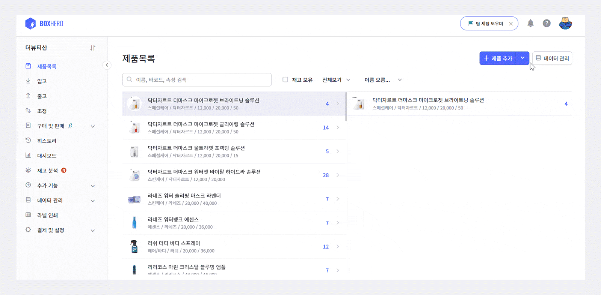
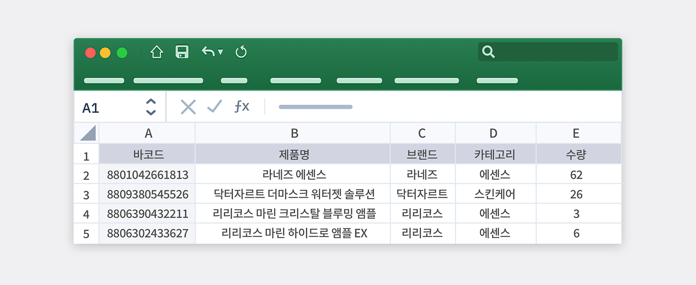
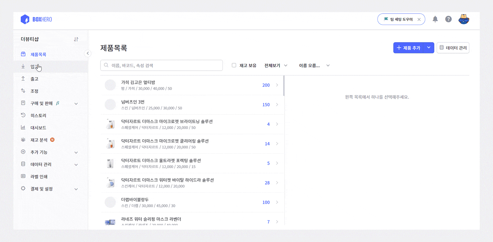
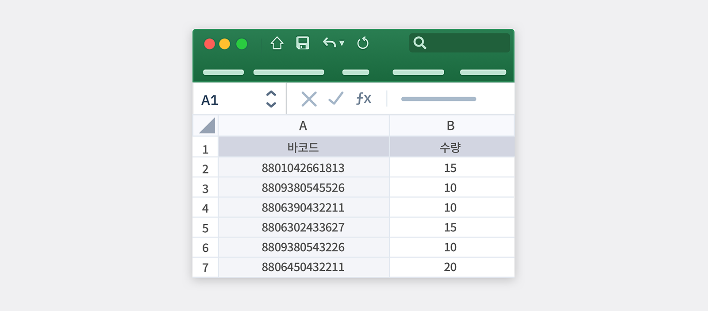
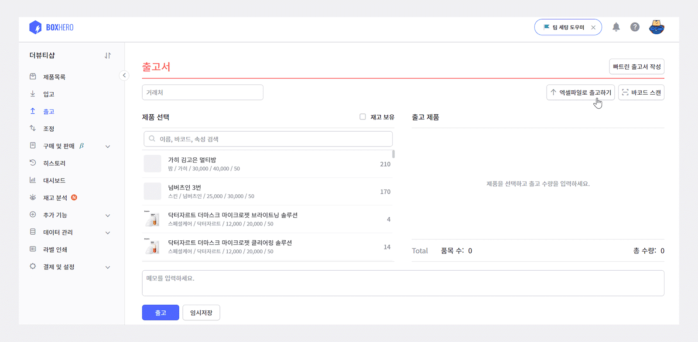
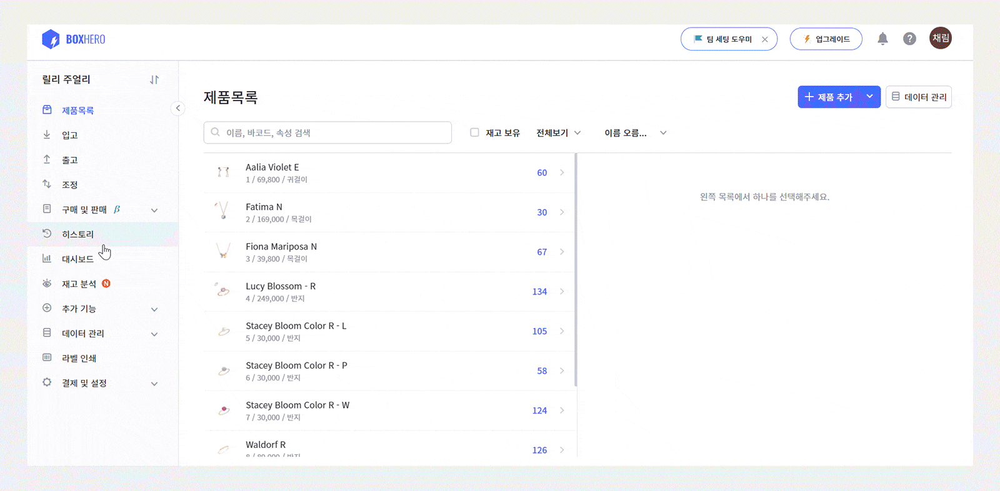
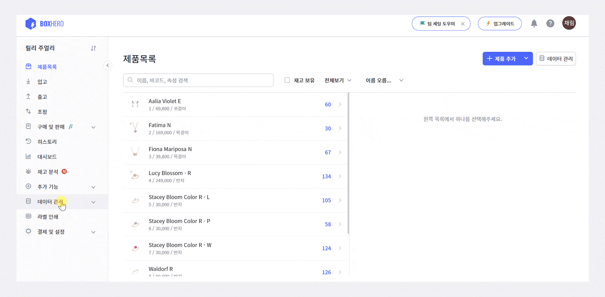

재고관리를 하고 계신 분들이라면 대부분 엑셀을 사용하고 계실거라 생각합니다. 

엑셀로 재고관리를 하면 별도의 장비가격이 들지 않고, 엑셀로 정리된 재고 데이터를 수기로 직접 간편하게 입력하여 수많은 데이터를 한번에 업로드 할수 있어 비교적 엑셀을 다룰줄 안다면 누구나 손쉽게 활용이 가능합니다.

하지만 컴퓨터에 엑셀이 당연히 설치 되어있어야 하며, 수많은 매장의 재고를 수기로 일일히 입력하기란 많은 시간과 노력을 필요로 할 뿐더러 정확성 측면에서도 크게 떨어질 수 있습니다. 

**이러한 단점을 보완하기 위해서는 나에게 맞는 재고관리 솔루션을 선택해야 합니다!**

재고관리는 꾸준히 관리되어야 하므로 무엇보다 지속가능한 솔루션을 선택하셔야 합니다. 어떤 솔루션이 자신에게 적합할지는 자신의 목적과 상황에 따라 달라지겠지만, 보편적으로 아래 항목들을 사전에 고려해보셔야 합니다.

- **첫째로 기록이 쉬워야 합니다.**  
기록 과정이 번거로우면 기록을 미루게 되고, 빠지는 기록이 늘어나 상시로 실재 재고와 시스템에 기록된 재고 사이에 편차가 발생하게 됩니다. 그 결과 실제 업무에서 기록된 재고를 믿을 수 없어 시스템을 사용하지 않게 되는 악순환이 발생합니다.

- **둘째로 현황을 언제 어디서든 간편하게 조회할 수 있어야 합니다.**  
열심히 기록했지만, 정작 필요할 때 원하는 정보들을 바로 볼 수 없다면 시스템의 효용이 떨어지게됩니다. 효용을 느낄 수가 없다면 수고스러운 기록 작업을 지속하기도 힘들어집니다.

- **셋째로 누구도 기록을 조작할 수 없어야 합니다.**  
내가 입력한 기록을 후에 누군가가 위조하여 수량을 변경하거나 삭제해도 이를 확인할 방법이 없다면 시스템의 신뢰가 떨어지게 됩니다.

### 그럼 박스히어로를 왜 사용해야 하나요?

**박스히어로는 재고관리에 특화된 솔루션입니다.** 입/출고 명세만 기록하시면, 나머지 작업은 모두 박스히어로가 해드립니다. 번거롭고 지겨운 작업을 최소화하여, 다른 업무에 집중할 수 있도록 도와드립니다!

현재 사용하고 있는 엑셀 파일을 어떻게 박스히어로에 적용할 수 있을지 알아볼까요?

<notice-box>

**기존의 엑셀 파일을 연동하려는데 초기 세팅 도움을 받을 수 있나요?**

엑셀로 만들어진 제품목록 연동에 어려움을 겪고 있다면 박스히어로에서 도움을 드립니다. 짧은 설문지에 팀 이름과 엑셀 파일을 올려주시면 최대한 빠르게 엑셀 재고 데이터를 박스히어로에 옮겨드립니다. 많이 이용해주세요! 

</notice-box>

자, 그럼 먼저 엑셀파일로 제품 등록부터 천천히 함께 시작할게요!

## Q. 엑셀파일로 제품 등록은 어떻게 하나요?

**엑셀 파일에서 제품 불러오기 기능**을 통해 일일히 제품을 추가하지 않고도 원래 재고관리할 때 사용하시던 엑셀 파일을 불러와 쉽게 제품을 추가할 수 있습니다. 

만약 엑셀 업로드에 어려움을 겪고 있다면 [박스히어로 팀에 초기 세팅을 요청](https://boxhero-invt.typeform.com/to/wwSmWtxK)하세요. 

<caution-box>

**엑셀 업로드 시 주의점**

파일의 첫 번째 행은 헤더로 인식되므로 바코드, 제품명, 카테고리, 수량 등 각 분류에 맞춰야 합니다. 
속성 (브랜드, 카테고리, 가격 등) 은 미리 데이터 관리 메뉴에서 추가해두어야 합니다.

</caution-box>

## Q. 엑셀 파일로 입출고는 어떻게 하나요?

### 1. 엑셀 파일로 **입고**하기

입/출고 메뉴를 클릭한 뒤 엑셀 파일로 입고하기를 누르면 오른쪽 상단에 엑셀 양식을 저장할 수 있는 메뉴가 있습니다! 양식에 맞춰 엑셀 파일 작성 후 엑셀 가져오기 과정을 통해 대량 제품 추가가 가능합니다.

<caution-box>

**입출고 엑셀 양식 주의점**

제품의 바코드와 수량을 정확하게 입력해주세요

</caution-box>

### 2. 엑셀 파일로 **출고**하기

## Q. 혹시 입출고 내역을 엑셀로 받을 수 있나요?

히스토리 메뉴를 클릭하신 후 입/출고, 제품, 거래처, 멤버, 기간 등으로 조건을 지정하고 엑셀 다운로드 버튼을 누르면 엑셀 파일을 쉽게 다운로드 받을 수 있습니다. 

<caution-box>

모바일 앱에서는 아직 엑셀 다운로드 기능을 지원하지 않는 점 양해 부탁드립니다!

</caution-box>

## Q. 제품 재고 목록을 엑셀로 다운로드받고 싶은데 어떻게 해야 하나요?

데이터 관리 메뉴를 클릭해 제품 탭에서 엑셀 다운로드 버튼을 누르면 제품 재고 목록을 엑셀로 다운로드 받을 수 있습니다!

<caution-box>

엑셀에서는 제품 사진이 포함되지 않는다는 점 유의해주세요!

</caution-box>

## 박스히어로에 엑셀을 적용하여 더 정확한 재고관리에 도전하세요!

박스히어로에는 다음과 같이 엑셀을 사용하여 재고관리 하기에 꼭 맞는 유용한 기능들이 포함되어 있습니다.

- 제품추가의 엑셀 파일에서 제품 불러오기 기능을 통해 한 번에 제품 등록을 할 수 있습니다.

- 수많은 입고/출고 과정을 엑셀 파일로 한 번에 정리가 가능합니다.

- 제품 재고 목록을 엑셀로 다운로드가 가능해졌습니다!

<tip-box>

**박스히어로는 PC와 모바일, 모든 환경에서 사용할 수 있습니다.**

PC가 없는 환경에서도 재고관리는 멈추지 않고 계속됩니다.

강력한 모바일 앱을 지원해 스마트폰에서도 박스히어로를 사용할 수 있습니다.

</tip-box>

