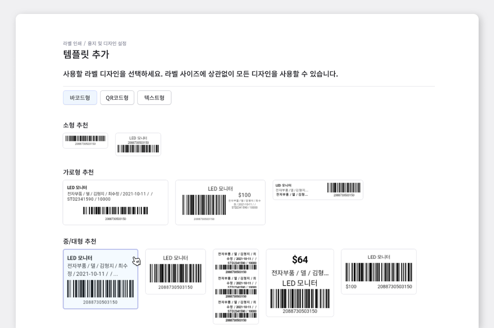
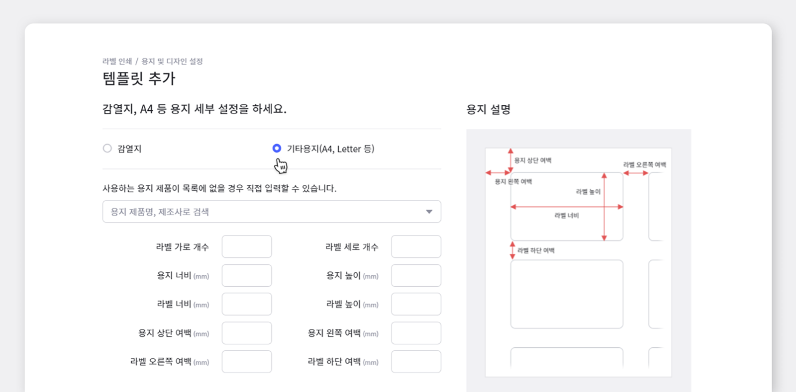
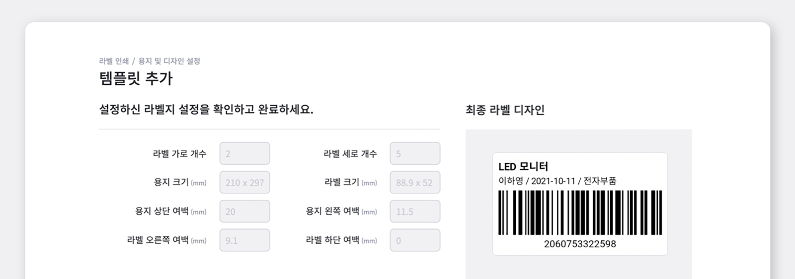
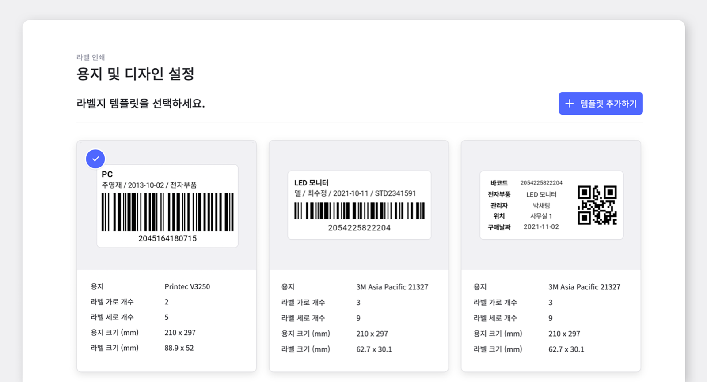
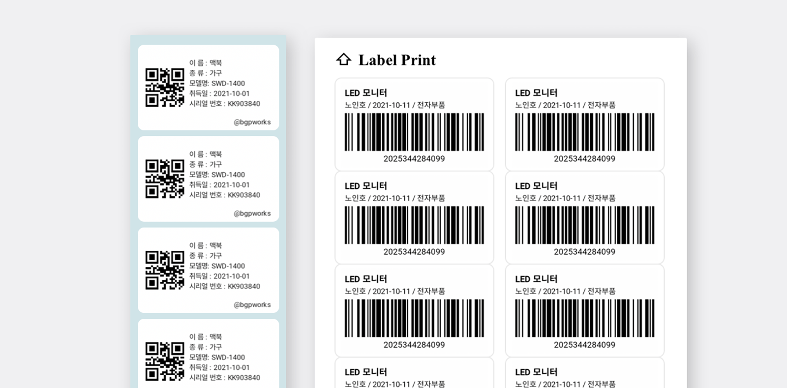

<gray-box>

**Q. 쇼핑몰 재고관리, 왜 필요한가요?**

**A. 효율적인 재고관리는 불필요한 시간 소모와 비용 지출을 줄여줍니다.**  
재고관리 프로그램을 통한 실시간 재고관리는 제품 판매기회를 더욱 극대화하고 더 나아가 재고 보관 비용 및 재고 관리 하는데 소요되는 업무시간을 대폭 줄일 수 있습니다.

 

**Q. 재고관리 프로그램으로 재고관리를 하면 어떤 점이 편리한가요?**

**A. 쉽지만, 정확하게! 좋은 재고관리 프로그램은 편리하고 효율적인 방법으로 재고를 관리해줍니다.** 
만약 재고를 제대로 관리하지 못한다면 고객이 추가적으로 제품을 요청했을 때 즉시 추가 발주가 필요하기 때문에 그로 인한 배송 지연의 원인이 되고, 만약 반대로 재고가 지나치게 많이 남게 되는 현상이 일어나면 남은 재고에 따른 비용이 비효율적으로 운용되어 사업의 흐름을 막게될 수도 있습니다. 그러므로 더욱 정확하고 세밀한 재고관리가 필요하며, 그 과정을 효율적으로 도와주는 재고관리 프로그램을 잘 고르는 것 또한 중요합니다. 만약 재고관리 프로그램을 사용하지 않는다면, 엑셀 또는 수기로 일일이 작성하여 관리해야하기 때문에 어렵고 번거로울 수 있으며 또 그만큼 시간도 많이 소요됩니다.

</gray-box>

## 쇼핑몰 재고관리의 필수 아이템, 바코드!

 

**원활한 쇼핑몰 재고관리를 위해서는 바코드를 빼 놓을 수 없습니다.** 바코드 시스템을 도입하면 스캔만으로 제품 정보들을 확인해볼 수 있을뿐더러, 입출고시 번거로운 작업을 효율적으로 해결할 수 있는데요! 이러한 바코드 시스템을 이용하기 위해선, 각 제품에 바코드가 부착되어야 관리가 가능하기 때문에 바코드 생성 작업은 필수입니다.

일반적으로 바코드 생성을 위해 엑셀이나 라벨지 회사에서 제공되는 프로그램을 떠올리실거에요. 
하지만 재고 관리에 사용하기 위해서는 수많은 라벨지에 일일이 제품명부터 입력해야하거나, 직접 라벨지부터 디자인을 해야하는 단점이 있습니다.

**하지만 박스히어로에서는 제품을 입력/선택만 하면 불필요한 과정 없이 신속하게 바코드 출력까지 가능합니다.**

지금부터 박스히어로와 함께 바코드 제작에서부터 출력까지 함께해 볼까요?

 

## 바코드가 들어간 라벨지를 디자인부터 출력까지 함께 만들어봅시다.

 

**1. 원하는 형태의 라벨지 템플릿을 선택해주세요.**

박스히어로는 다양한 라벨지 템플릿을 무료로 제공하고 있습니다. **바코드형** 부터 요즘 많이 사용하는 **QR코드형,  바코드와 QR코드가 포함되어 있지 않은 텍스트형**까지 다양하게 준비되어 있습니다.

<tip-box>

현재 제공되는 디자인 외에 새로운 라벨지 디자인이 필요하신 경우, **박스히어로 고객센터**로 연락주세요.

</tip-box>

 

**2. 인쇄할 용지에 따라 감열지/기타용지 등 원하는 용지로 선택해주세요.**

박스히어로에서 제공하는 용지 정보에 원하시는 용지가 있을 경우, 자동 설정되어 바로 다음 단계로 넘어가면 됩니다. 하지만 원하는 용지 제품이 목록에 없거나 맞춤형 수치가 따로 있을 경우, 직접 입력하여 사용 가능합니다.

 

**3. 라벨에 표기할 내용과 세부 디자인을 설정해주세요.**

<video src="images/img_5.mp4" style="width:100%" muted autoplay loop playsinline></video>
<invisible>라벨지 템플릿에 표기할 내용과 디자인 설정하기</invisible>

<tip-box>

- 라벨지에 들어갈 내용과 폰트 크기, 최대줄수 등을 변경할 수 있습니다.

- {{제품 속성}} 처럼 입력하면 자동으로 제품의 해당 속성 값을 불러옵니다.

- 라벨지에 넣고 싶은 속성 정보를 아래에서 클릭하면 복사됩니다.

- 이후 원하시는 영역에 붙여 넣으면 쉽게 추가할 수 있습니다.

</tip-box>

 

**4. 라벨지에 들어갈 내용을 디자인한 후 최종 라벨 디자인을 확인하고 저장해주세요!**

저장된 라벨지 설정은 언제든지 용지 및 디자인 설정 메뉴에서 이용하실 수 있습니다.

**5. 저장된 템플릿은 바로 라벨지에 출력!**

박스히어로와 함께 쉽고 빠르게, 깔끔한 디자인으로 바코드 라벨지를 생성해보세요!

바코드 라벨지 생성에 어려움을 겪고 계신가요? 지금 바로 박스히어로를 시작해보세요.

박스히어로는 누구나 쉽게 사용할 수 있는 재고관리 특화 솔루션입니다.

박스히어로가 제공하는 다양한 라벨지 템플릿을 활용해 쉽고 빠르게 원하시는 바코드 라벨 출력이 가능합니다.

**이제 박스히어로와 함께 쉽고 정확하게 재고관리하세요.**

 

<tip-box>

**박스히어로는 PC와 모바일, 모든 환경에서 사용할 수 있습니다.**

PC가 없는 환경에서도 재고관리는 멈추지 않고 계속됩니다.

강력한 모바일 앱을 지원해 스마트폰에서도 박스히어로를 사용할 수 있습니다.

</tip-box>

