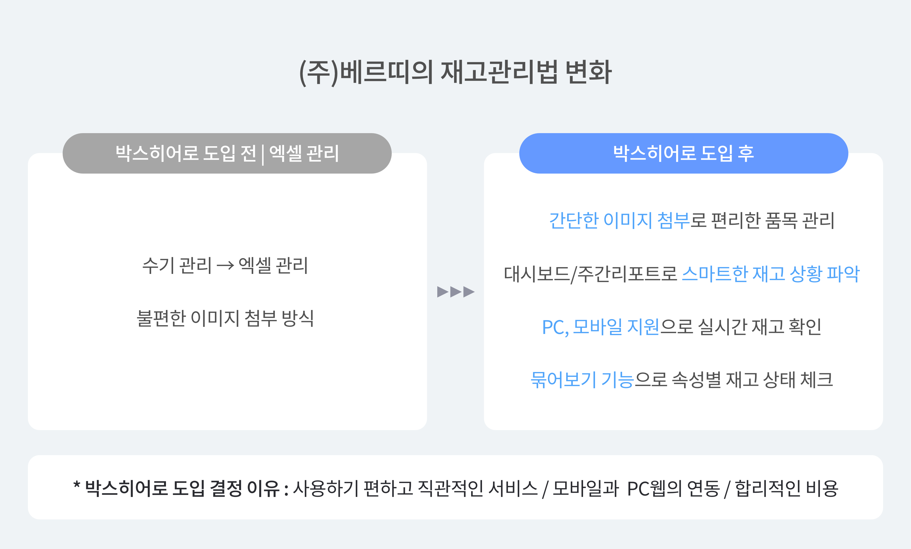
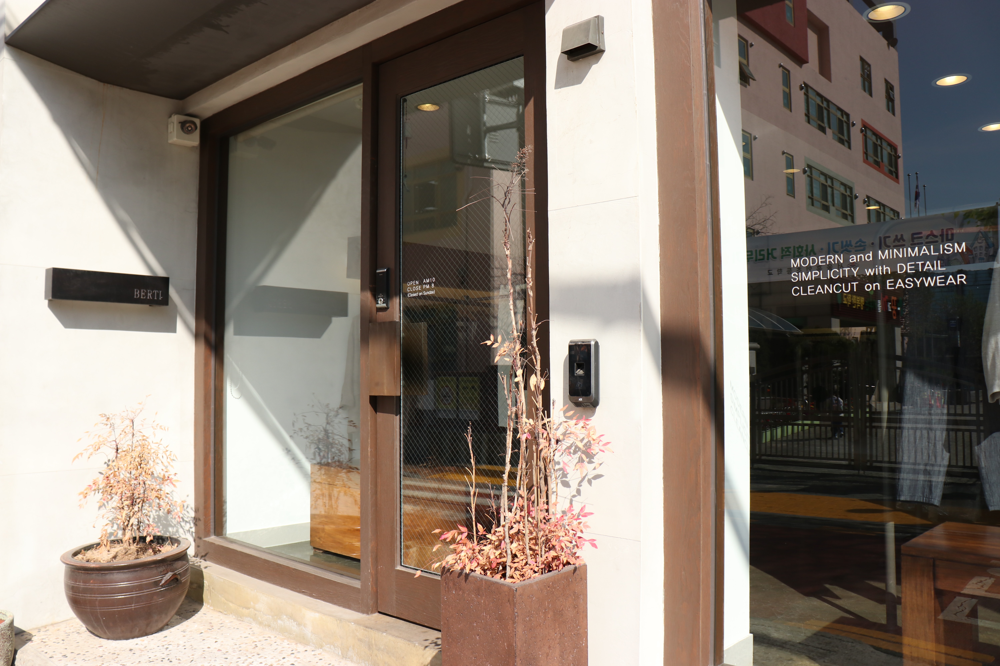
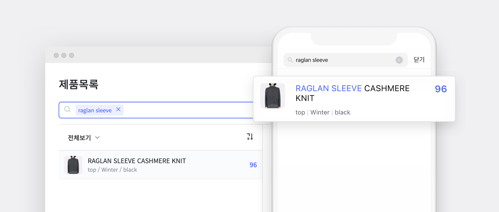
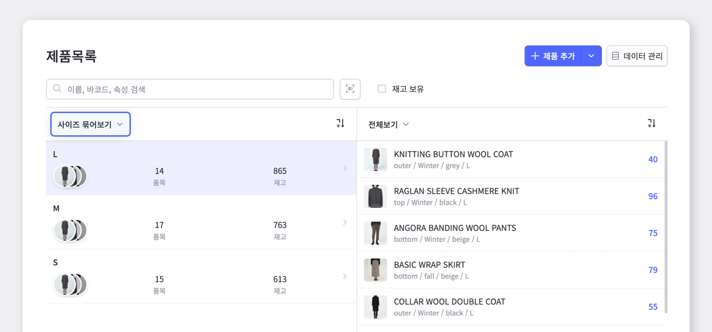
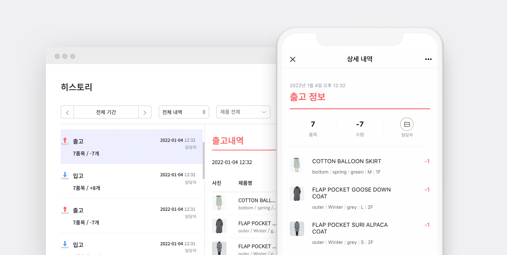
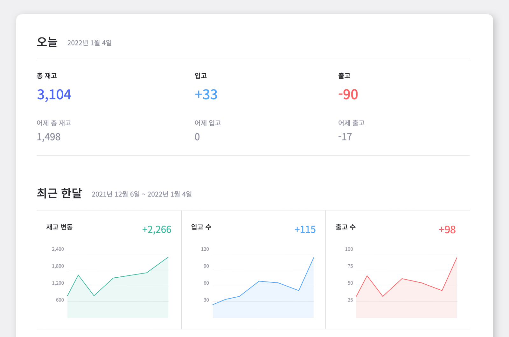
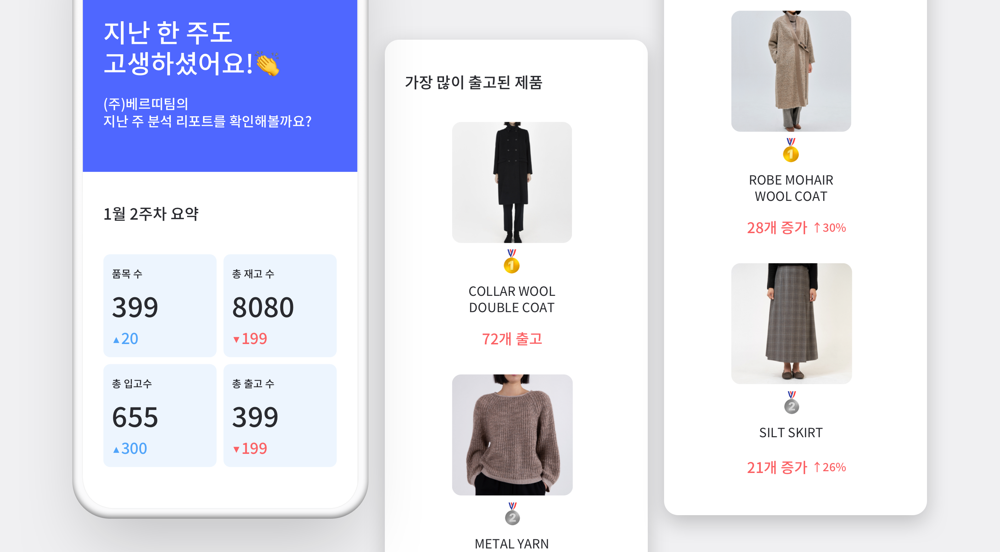

<gray-box title="[박스히어로 인터뷰 vol.02] (주)베르띠">

온라인 쇼핑몰과 오프라인 매장을 모두 운영 중인 의류 브랜드 베르띠에서 재고관리를 담당하시는 안재환 담당자님과의 인터뷰를 소개합니다!

</gray-box>

 

안녕하세요, 여성 의류 쇼핑몰, 베르띠(Berti)에서 재고관리를 총괄하고 있는 안재환 담당자입니다.

 

## 매일 쓰는 프로그램이니 편리한 걸 찾고 있었는데, 박스히어로가 적합했죠.

<gray-text>**Chapter 1. 박스히어로 도입 이전**</gray-text>

 

### Q. 박스히어로 사용 전엔 어떻게 재고관리를 하고 계셨나요?

제가 담당하기 전까지는 수기로 관리하고 있었다고 알고 있습니다. 입사하고 나서는 엑셀로 관리를 시작했는데 이미지를 엑셀에 첨부해서 관리하기가 어렵더라고요. 아무래도 품목도 많다 보니 각 품목마다 이미지를 첨부해 관리하고 싶은데 그게 안되니 답답했고, 엑셀 재고관리도 역시나 한계가 있다는 생각이 들었습니다.

다른 방안을 찾기 위해 여러 재고관리 프로그램을 찾아보다가 박스히어로를 알게 되었고 사장님께 도입에 대해 말씀드려 지금까지 사용하고 있습니다.

### Q. 다른 프로그램 도입은 고려하지 않으셨나요?

사실 다른 프로그램들을 찾아보니 우선 ERP가 가장 접근이 쉬운 것 같았습니다. 저희 매장에 맞게 커스터마이징도 가능하고 기능도 많은 듯했지만, 도입 가격이 천만원 단위로 뛰니 당황스러웠어요. 그 정도의 규모는 저희와 맞지 않는다고 생각했습니다. 사실 이미 어느정도 저희가 관리하는 방식은 정해져 있었고, 간단한 재고관리 보조수단이 필요했거든요.

### Q. 박스히어로로 결정하신 이유가 있을까요?

우선 사용하기 편하고 직관적인 서비스여서 선택하게 됐습니다. 개인적으로 복잡한 걸 안 좋아하기도 하고, <mark>매일 쓰는 프로그램이니 최대한 사용하기 편리한 걸 찾고 있었는데 박스히어로가 적합했어요.</mark>

또, 모바일과 PC웹이 연동되는 부분도 크게 작용했고 가격도 매우 합리적이어서 선택하게 된 것 같습니다.

 

 

## 이젠 언제 어디서든 박스히어로 웹과 앱으로 실시간 수량 파악이 가능해졌어요.

<gray-text>**Chapter 2. 박스히어로 도입 이후**</gray-text>

### Q. 박스히어로 도입 이후 어떤 변화를 가장 크게 느끼시나요?

정확하고 편리한 재고관리가 이제 가능해졌다는 점이 가장 큰 변화입니다. 이전에는 거래처에서 재고 문의가 오면 그때마다 일일이 세어봐야 했는데, 이젠 언제 어디서든지 박스히어로 웹과 앱을 활용해 실시간 수량 파악이 가능해졌어요.

 

- **웹과 앱을 활용한 실시간 수량 파악**

### Q. 현재 박스히어로를 어떻게 사용하고 계신가요?

초반에 박스히어로에 문의하니 관리하던 엑셀을 대신 세팅해주셔서 별 어려움 없이 시작하게 됐어요. 제품 목록에서 속성을 통해 제품 정보를 입력한 뒤 제품 목록에서 묶어보기를 통해 위치별, 사이즈별, 색상별 등 속성별로 현재 재고를 바로 파악하고 있습니다. 이렇게 묶어보기를 통해 많이 남은 재고를 빠르게 찾아내서 세일이 필요한 재고는 먼저 분류해두는 등 정확하게 재고관리를 하고 있어요.

 

- **묶어보기 기능을 통한 속성별 재고 파악**

현재 제가 전반적인 관리를 담당하고 있고, 다른 팀원들은 현 재고 상황을 조회하는 방식으로 사용하고 있는데요. 사무실에서는 주로 PC웹으로 접속해 입출고 내역을 입력해두고, 층별로 재고 확인할 때나 다른 멤버들이 재고 확인이 필요하면 모바일 앱에 접속해 확인하고 있습니다.

 

- **언제 어디서나 확인할 수 있는 투명한 입출고 내역**

### Q. 가장 유용하게 생각하시는 박스히어로의 기능이 있으신가요?

제품을 새로 등록할 때 모바일 앱에서 바로 사진을 찍어 등록할 수 있는 점이 우선 매우 편리하게 느껴집니다. 한 번 등록해두면 확인할 때나 업무 진행 시 제품 이미지 관리가 매우 편리해요. 대시보드 또한 유용하게 보면서 최근 한 달 동안의 재고 상황에 대해 계속 파악하고 있고, 사장님께 보고드릴 땐 월요일마다 메일로 오는 주간리포트를 사용해서 주별로 출고가 늘어난 제품 등 잘 사용하고 있습니다.

 

- **대시보드로 한 달 동안의 재고 상황 파악!**

- **메일로 받는 분석 리포트로 지난 주의 재고 요약까지-**

### 쇼핑몰 재고관리는 박스히어로에서 쉽게 시작하세요.

사이즈부터 색상까지 손쉬운 개별 관리가 가능합니다.

실시간 공유로 팀원들과 놓치는 재고 없이 정확하게 관리하세요.

월간 대시보드, 주간 리포트로 내 재고 상황도 박스히어로에서 한 번에 파악할 수 있습니다.
