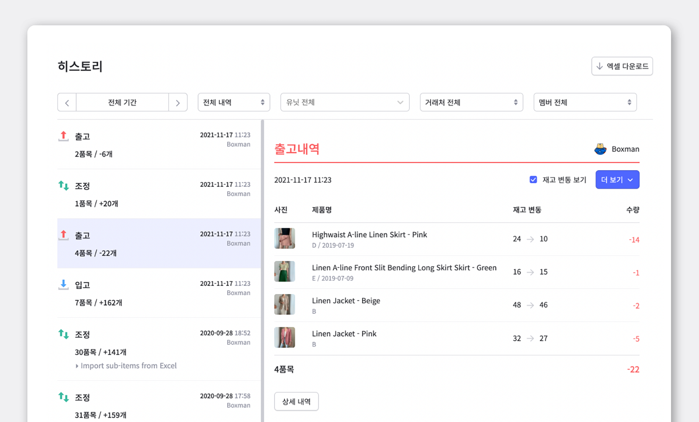
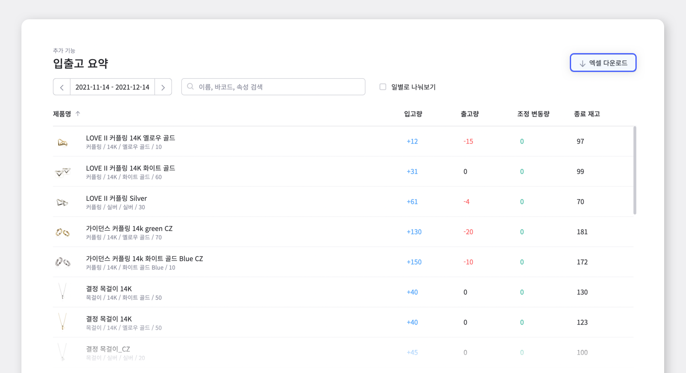

재고 관리를 하다 보면, 입고/출고/조정/이동 등 다양한 상태의 재고가 존재하게 됩니다. 여러 과정을 거치다 보면, 각 재고의 현황을 추적하기 점점 어려워지는데요. **박스히어로는 이런 문제점을 해결하기 위해 입출고 요약 기능을 제공하고 있습니다.**

입출고 요약 기능에 대해 좀 더 자세하게 알아볼까요?

### 입출고 요약은 어떤 기능인가요?

입고/출고를 진행하면, 입출고 요약 메뉴에서 특정 날짜 또는 기간에 맞춰 해당 재고의 입출고 수량을 조회할 수 있습니다. 이 외에도 조정을 통한 재고 변동량과 현재 재고 수량도 함께 확인이 가능합니다.  
<gray-text>* 만약 외부에 자료 전달이 필요할 경우, 빠르게 엑셀 파일로 다운로드하여 자료 보관이 가능합니다.</gray-text>

### 그럼 입출고 요약은 어떤 상황에서 꼭 필요한 기능일까요?

요즘처럼 연말이 다가오는 시점에서 재고 정산이 필요할 때, 또는 재고 자산 평가에 필요한 회계 처리를 하기 위해 특정 날짜 또는 기간을 설정하면 그에 해당하는 재고의 입/출고, 조정량을 바로바로 조회할 수 있습니다. 또한 내년 목표 설정을 위해 예상 출고량을 알아보고 싶을 때, 입출고 요약 기능과 재고 분석 기능을 사용하면 과거 출고되었던 데이터를 이용해 보다 정확한 파악이 가능합니다.

 

### 박스히어로의 입출고 요약 기능을 어떻게 효과적으로 사용할 수 있을지 알아볼까요?

입출고 기록은 히스토리 메뉴를 통해서도 확인 할 수 있지만, `히스토리`는 입고, 출고 및 조정 내역을 각각 보여주기 때문에 변동된 수량을 합산하여 보기 어렵다는 단점이 있습니다. 바로 이럴때 `입출고 요약` 기능을 활용하면 효과적으로 원하는 데이터를 조회할 수 있습니다.

`입출고 요약` 기능에서는 특정 기간 동안의 입고량, 출고량, 조정 변동량 등을 제품 별로 요약해 한눈에 확인할 수 있습니다. 조회중인 자료를 외부로 전달해야 할 경우, 오른쪽 상단 `엑셀 다운로드` 버튼을 누르면 동일한 데이터를 엑셀 파일로 다운로드 받을 수 있습니다.

<tip-box>

**조정 변동량이란?**

박스히어로에서는 입고와 출고된 수량 외에도 조정을 통해 재고 수량을 변경 할 수 있습니다. 조정으로 발생한 변동 수량은 조정 변동량이라고 하며, 조정 변동량과 현재 수량을 한번에 확인할 수 있어 편리합니다.

</tip-box>

 

조회 기간을 설정 후, 일별로 나눠보기 메뉴를 클릭하면 해당 날짜의 입고/출고 및 조정 변동량, 종료 재고량까지 한 눈에 파악이 가능합니다.

<video src="images/img_5.mp4" style="width:100%" muted autoplay loop playsinline></video>
<invisible></invisible>

 

설정된 기간 동안 이루어진 입/출고 내역을 요약하여 보여주는 `입출고 요약` 기능을 활용하여 완벽한 재고관리에 한 발짝 더 다가서기를 바랍니다!

## 재고관리에 어려움을 겪고 계신가요? 지금 바로 박스히어로를 시작해보세요.

박스히어로는 누구나 쉽게 사용할 수 있는 재고관리 특화 솔루션입니다.

다양한 재고관리 기능을 통해 업종 구분없이 모든 비즈니스에서 도입이 가능합니다.

**이제 박스히어로와 함께 쉽고 정확하게 재고관리하세요.**

 

<tip-box>

**박스히어로는 PC와 모바일, 모든 환경에서 사용할 수 있습니다.**

PC가 없는 환경에서도 재고관리는 멈추지 않고 계속됩니다.

강력한 모바일 앱을 지원해 스마트폰에서도 박스히어로를 사용할 수 있습니다.

</tip-box>
