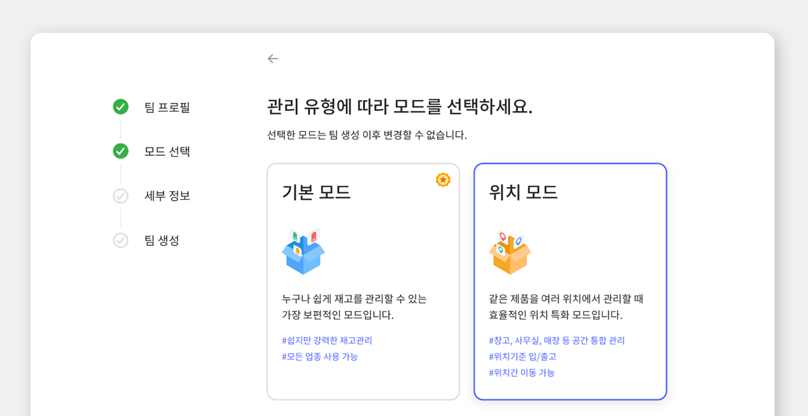
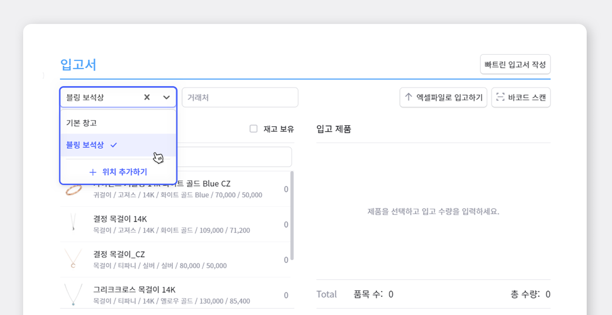
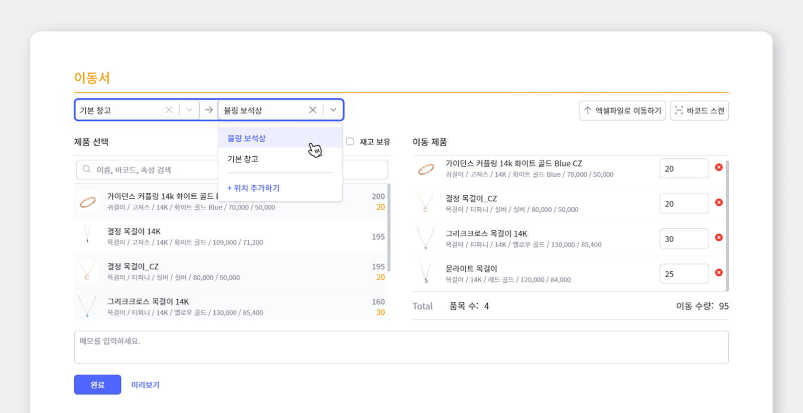
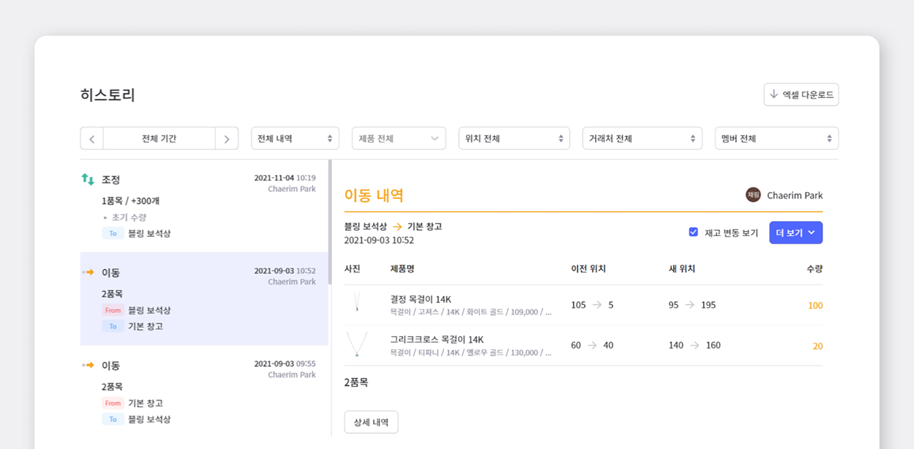
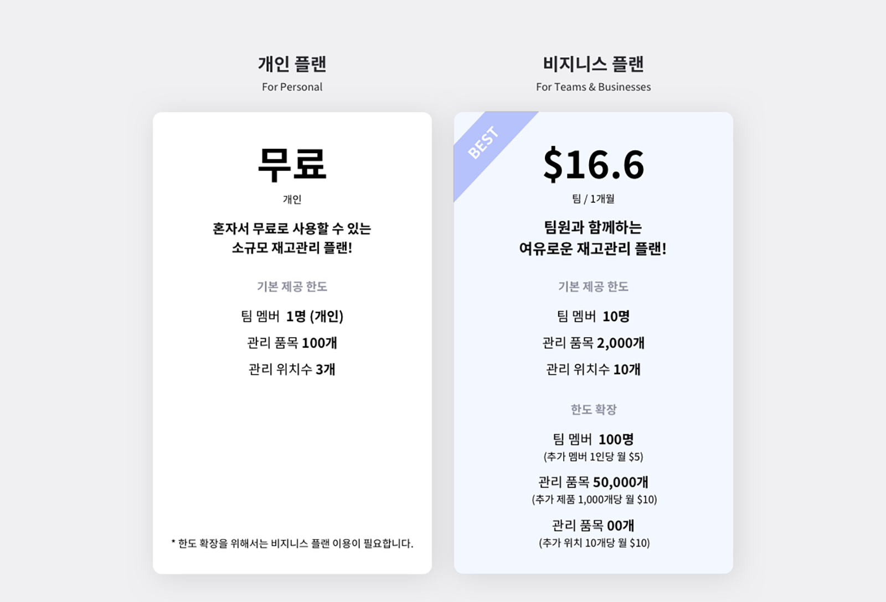
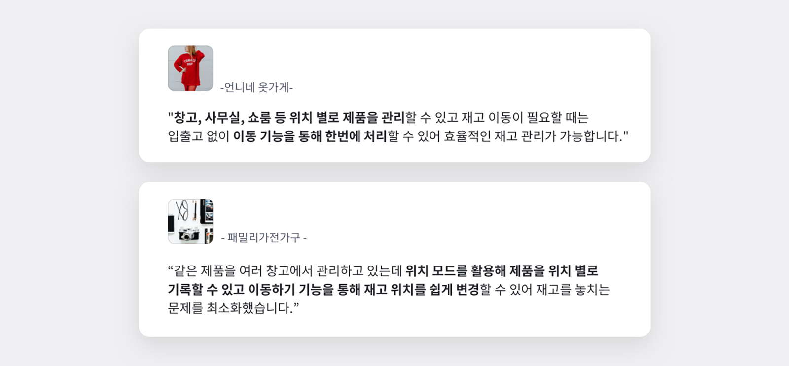

### 각 부품들을 여러 위치에 보관하고 있어 재고관리에 어려움을 겪고 계신가요?

 

재고관리를 하다보면 동일한 상품들이 여러 위치에 흩어져있거나, 출고 전 상품들이 여러 위치로 이동해야하는 경우가 있습니다. 이런 경우에는 현재 상품이 어디에 있는지 알기가 어려워 유실되기 쉽고, 각 위치에 재고가 얼마나 있는지 한 눈에 파악하기도 어렵습니다. 더군다나 실시간 공유도 안 되면 팀원들끼리 정보 공유가 어려워 혼선을 빚기 일쑤인데요.

**박스히어로에서는 이런 문제를 해결하기 위해 '위치모드'라는 특수모드를 제공합니다.**

<mark>위치모드를 사용하면, 같은 제품이 여러 위치에 보관되어 있을 경우에도 각각의 위치만 입력하여 편리하게 재고관리와 재고분석이 가능합니다.</mark> 이번 게시물에서는 박스히어로를 사용하여 어떻게 여러 위치에 있는 수많은 제품을 쉽게 재고관리할 수 있는지 알아보도록 하겠습니다!

 

## 1. 위치모드, 그것이 알고싶다.

 

**박스히어로의 기본모드와 위치모드, 무엇이 다른가요?**

위치모드 사용법에 대해 앞서, 기본모드와 위치모드의 차이점을 알아봅시다.

<gray-box>

- **기본모드**

기본모드는 가장 보편적인 모드로 재고를 제품 별로 간편하게 관리할 수 있는 모드입니다. 바코드와 제품명을 제품마다 입력해 재고를 관리하며 제품에 관련된 추가정보는 제품 속성을 추가해 쉽고 빠르게 제품 분류와 검색을 할 수 있습니다.

- **위치모드**

위치모드는 위치에 특화된 모드로 동일한 제품을 여러 장소에 나눠서 관리할 경우 효율적으로 사용할 수 있는 특수 모드입니다. 재고의 보관 위치를 기준으로 입출고하며 '이동' 메뉴를 통해 제품의 보관 위치를 쉽고 빠르게 변경할 수 있습니다.

</gray-box>

 

**그럼 어떤 경우, 위치모드를 사용하면 좋을까요?**

- 재고의 **보관 위치가 다양**하고 위치를 기준으로 입/출고하고 싶은 경우

- 재고의 **보관 위치 이동이 빈번**한 경우

- **여러 선반이나 칸으로 위치를 나눈 대형 창고**를 관리하는 경우

이런 경우 위치모드를 사용하시면, 상품들이 어디에 있는지 빠르게 파악될 뿐만 아니라 팀원들과 실시간 공유가 가능해 보다 정확한 재고관리를 할 수 있습니다.

 

## 2. 위치모드, 어떻게 사용하나요?

이제 직접 위치모드를 시작해 봅시다. 먼저, 새로운 팀을 생성하는 방법은 기존의 기본모드와 동일합니다.

**1. `새로운 팀 생성` > `팀 프로필 작성` > `위치 모드`를 선택해주세요!**

**2. 팀 생성 후, `데이터 관리` > `위치` 에 재고를 보관하는 위치를 추가해줍니다.**

위치 추가 뿐만 아니라, 최근 삭제된 위치도 조회 및 복구가 가능합니다.

<video src="images/img_5.mp4" style="width:100%" muted autoplay loop playsinline></video>
<invisible>데이터 관리에서 위치 추가하기</invisible>

 

**3. 위치 추가 후 제품 등록할 때 현재 재고의 위치도 같이 선택하여 입력을 완료해주세요!**

<video src="images/img_6.mp4" style="width:100%" muted autoplay loop playsinline></video>
<invisible></invisible>

## 3. 위치모드의 기능 활용법

**1) 입/출고**

입/출고 시, 위치를 먼저 설정한 후 거래서를 작성하면 어느 위치에서 제품의 입/출고가 이뤄지는지 간단하게 확인 할 수 있습니다.

 

**2) 이동**

이동서를 작성하여 관리하고 있는 각 위치 내에서 재고를 이동 할 수 있습니다.

 

**3) 히스토리**

히스토리 메뉴에서는 재고의 상태와 이동 내역을 한눈에 확인할 수 있어 투명한 관리가 가능합니다.

## 4. 위치모드 요금 안내

기본모드와 제공 한도는 동일하지만 한도 측정 기준이 모드에 맞게 일부분 달라집니다.

## 박스히어로의 위치모드는 이렇게나 편리합니다!

박스히어로의 위치모드와 함께 여러 위치에 흩어져있는 재고를 어렵지 않게 관리해보세요.

 

이 외의 위치모드에서 사용할 수 있는 **박스히어로의 추가 기능**에 대해서 알아보고 싶으시다면, [더 알아보기 : 박스히어로의 추가 기능에 대해 알아보기](https://www.boxhero-app.com/ko/blog/posts/%EB%B0%95%EC%8A%A4%ED%9E%88%EC%96%B4%EB%A1%9C-%EC%B6%94%EA%B0%80%EA%B8%B0%EB%8A%A5%EB%93%A4%EC%97%90-%EB%8C%80%ED%95%B4-%EC%95%8C%EC%95%84%EB%B3%B4%EA%B8%B0)를 참고해주세요!

### 재고관리에 어려움을 겪고 계신가요? 지금 바로 박스히어로를 시작해보세요.

박스히어로는 누구나 쉽게 사용할 수 있는 재고관리 특화 솔루션입니다.

다양한 재고관리 기능을 통해 업종 구분없이 모든 비즈니스에서 도입이 가능합니다.

**이제 박스히어로와 함께 쉽고 정확하게 재고관리하세요.**

 

<tip-box>

**박스히어로는 PC와 모바일, 모든 환경에서 사용할 수 있습니다.**

PC가 없는 환경에서도 재고관리는 멈추지 않고 계속됩니다.

강력한 모바일 앱을 지원해 스마트폰에서도 박스히어로를 사용할 수 있습니다.

</tip-box>

