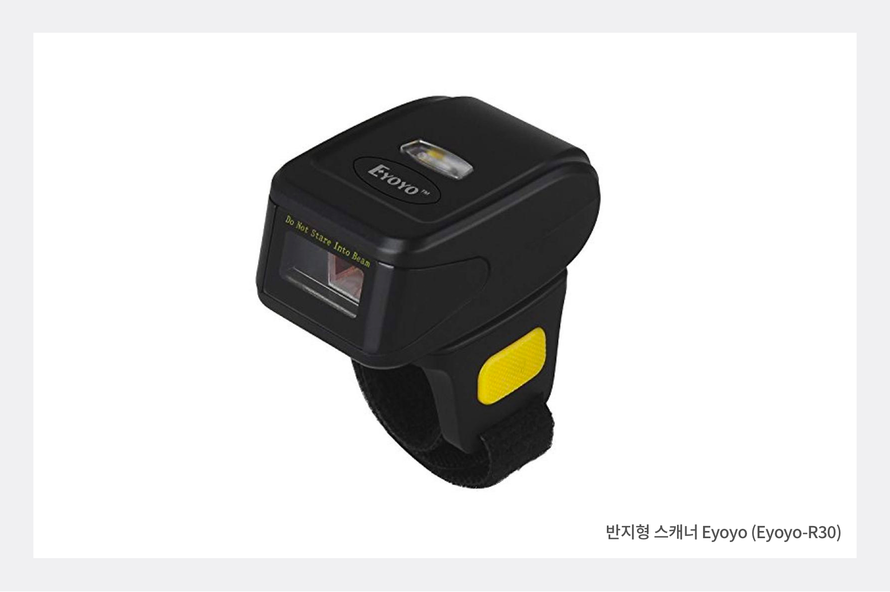
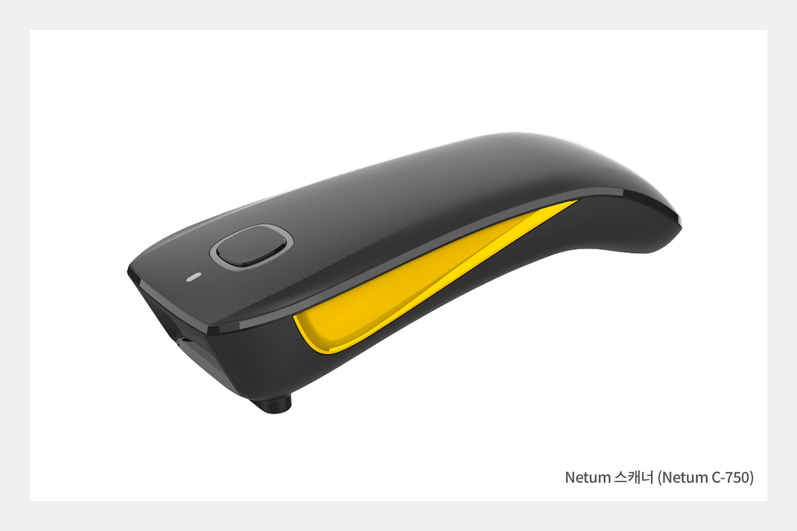
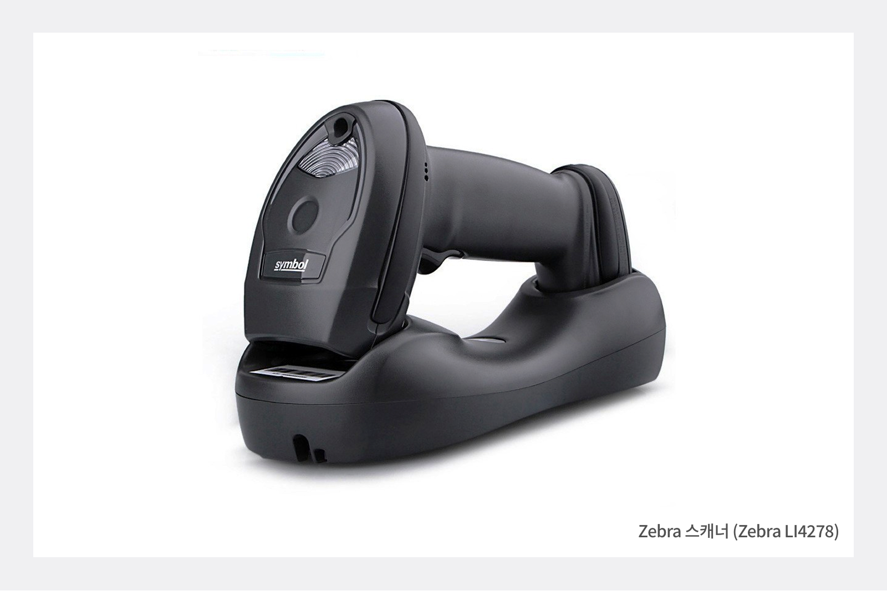
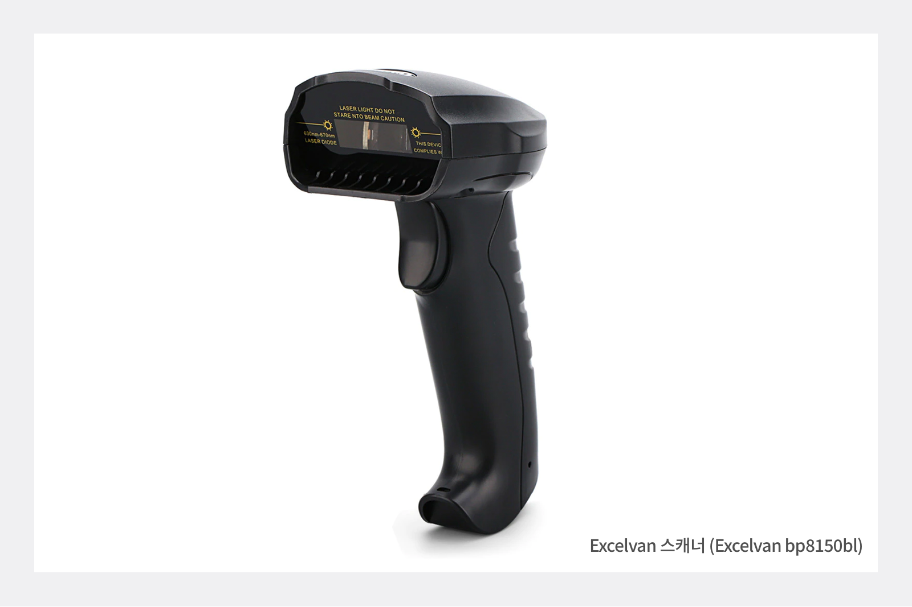
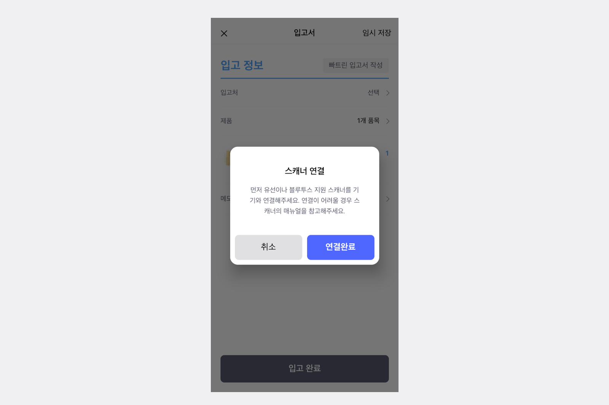

앞선 [바코드 스캐너, 어떤 제품을 골라야 할까? (1)](/ko/blog/posts/바코드-스캐너-어떤-제품을-골라야-할까-1)에서는 사용 환경과 편의성에 따른 바코드 스캐너의 종류에 대해 알아보았습니다!

이번 글에서는 전 글을 토대로, **박스히어로에 직접 사용하고 있는** 바코드 스캐너들을 소개해드리겠습니다.

### 반지형 Eyoyo 스캐너

초소형 사이즈의 손가락에 끼워서 사용하는 바코드 스캐너로, 이동하면서 바코드를 스캔해야하는 사업장에 있으시다면 추천하는 스캐너 종류입니다.

- **모델명 Eyoyo (Eyoyo-R30)** 가격 : 15만원대 (오픈마켓)

## 소형 Netum 바코드 스캐너

반지형 스캐너와 같이 크기가 작아 휴대성이 좋은 스캐너입니다. 창고 등 이동하며 스캔을 해야하는 경우에 추천하는 스캐너 중 한 종류입니다.

- **모델명 Netum C750** 가격 : 30달러대 (해외 직구)

### Zebra 바코드 스캐너

가격대가 높은 스캐너에 속하며, 다른 스캐너에 비해 제품 사이즈가 큰 편입니다. 한 자리에서 스캔을 진행하는 사업장에 보다 적합한 스캐너입니다.

- **모델명 Zebra LI4278** 가격 : 30만원대 (오픈마켓)

### Excelvan 스캐너

Zebra 바코드 스캐너와 같이, 지정된 곳에서 바코드 스캔을 할 경우 편리한 바코드 스캐너입니다.

- **모델명 Excelvan bp8150bl** 가격 : 20달러대 (해외 직구)

박스히어로가 직접 사용하고 있는 바코드 스캐너에 대해 소개해드렸습니다! 
박스히어로는 소개해드린 스캐너 외에도 판매중인 모든 바코드 스캐너와 연동이 되는 점, 잊지 말고 참고해주세요.

이제 바코드 스캐너가 준비되었다면, 박스히어로에 연동하여 쉽고 편한 재고관리를 하는 일만 남았습니다! 함께 박스히어로에 바코드  스캐너를 연동하는 방법에 대해 알아볼까요? 
<gray-text>* 바코드 스캐너가 준비 되지 않은 분들도 스마트폰을 이용하여 손쉽게 박스히어로의 바코드 스캔 기능을 이용할 수 있습니다.</gray-text>

## 박스히어로와 블루투스 스캐너 연결하기

먼저, 박스히어로 어플에 접속하여 블루투스를 이용해 스캐너와 기기를 연동하기만 하면 됩니다. 스캐너 연결이 어려울 경우, 준비하신 바코드 스캐너의 기기 메뉴얼을 참고해주세요.

## 박스히어로 어플을 활용하여 바코드 스캔하기

바코드 스캐너가 없으신 분도 걱정마세요. 박스히어로와 함께라면 스마트폰 카메라를 이용하여 바코드 시스템을 이용할 수 있습니다!

<video src="images/img_7.mp4" style="width:100%" muted autoplay loop playsinline></video>
<invisible>스마트폰 카메라를 활용하여 바코드 스캔하기</invisible>

### 이제 박스히어로와 함께 쉽고 정확하게 재고관리하세요.

재고관리에 어려움을 겪고 계신가요? 지금 바로 박스히어로를 시작해보세요.

박스히어로는 누구나 쉽게 사용할 수 있는 재고관리 특화 솔루션입니다

다양한 재고관리 기능을 통해 업종 구분없이 모든 비즈니스에서 도입이 가능합니다.

 

<tip-box>

### 박스히어로는 PC와 모바일, 모든 환경에서 사용할 수 있습니다.

PC가 없는 환경에서도 재고관리는 멈추지 않고 계속됩니다.

강력한 모바일 앱을 지원해 스마트폰에서도 박스히어로를 사용할 수 있습니다.

</tip-box>
