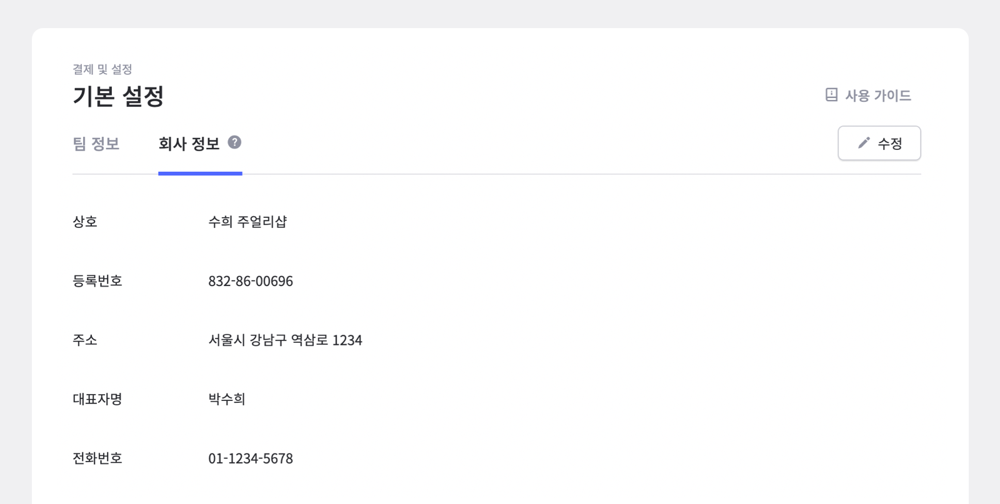
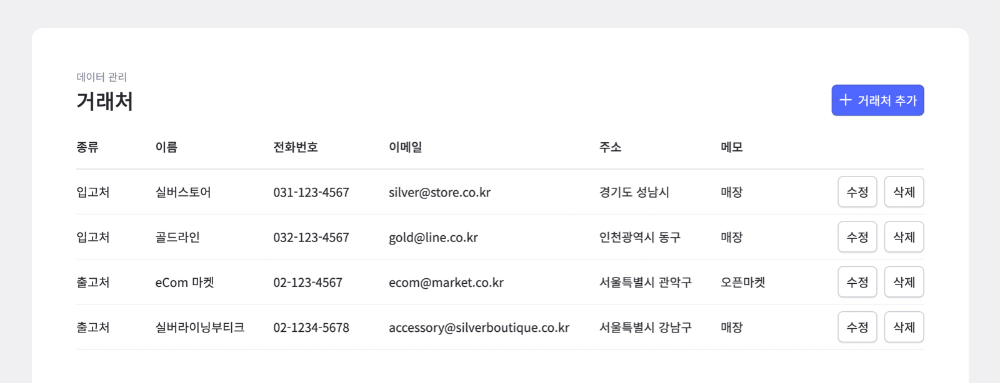
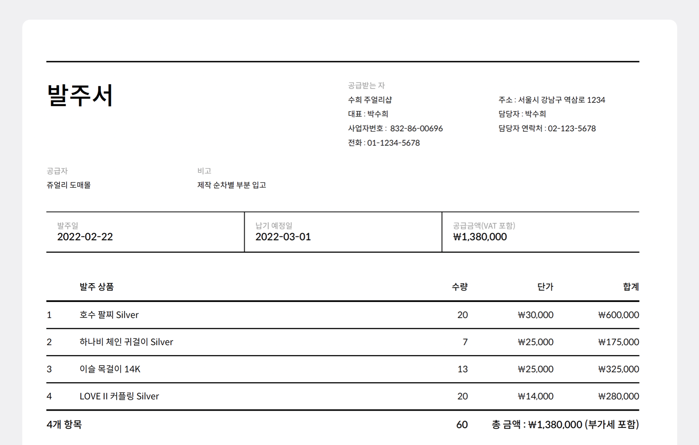
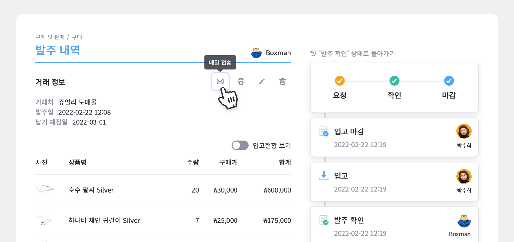
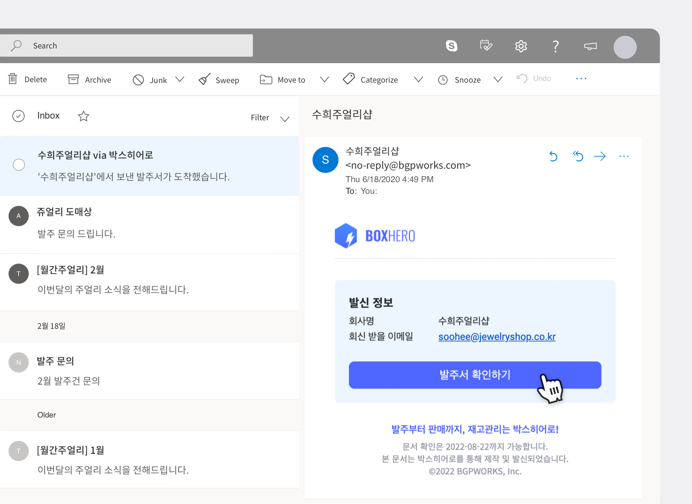

발주서는 다양한 곳에서 기본적으로 사용되는 문서입니다. 기업부터 작은 사업장, 심지어는 프리랜서까지도 필요한데요. 하지만 사업이나 거래의 특성에 따라 내용이 조금씩 다를 수 있기에 모든 발주서가 동일한 형식으로 작성되진 않습니다.

그럼에도 발주서에 꼭 들어가야 하는 항목들은 어떤 게 있을까요?

 

<gray-box title="발주서 체크리스트">

**1. 무엇을, 몇 개, 언제 거래하나요?** 
발주서의 목적이 되는 주요 거래 내용입니다. 항목명부터 수량, 단위, 단가, 총 금액까지 해당되는 내용이 있을 경우 빠짐없이 포함되어야 합니다. 또한 납기일에 대한 명시와 필요할 경우 발주일(문서가 작성된 날짜)도 기입하는 것을 추천드립니다.

**2. 누가 누구에게 보내는 문서인가요?** 
발주자와 공급자의 정보 또한 기입되어야 합니다. 두 곳의 기업명, 회사와 함께 담당자의 이름 또한 추가가 필요합니다.

**3. 공급자가 추가로 참고해야 할 것들은 어떤 게 있나요?** 
위 항목 외에 상대에게 전달 또는 문서에 남겨야 하는 내용이 있다면 마찬가지로 포함해주세요. 예를 들어 부가세가 포함된 금액인 경우 ‘부가세 포함’을 추가할 수도 있고, 해당 거래건에만 해당되는 조건이 있다면 마찬가지로 기입할 수 있습니다.

</gray-box>

## 그럼에도 실수 없이 작성하고 싶다면?

발주서는 여러 거래처에 매번 항목을 수정해 보내는 작업이라 실수가 발생하기 쉽습니다. 이러한 실수를 방지하기 위해선 반복적으로 기입하는 것들을 없애고, 자동화 시키는 게 중요한데요. 반복적인 업무는 줄이고, 간편하게 클릭만으로 발주서 작성부터 발송까지 완료할 수 있는 프로그램, 박스히어로를 소개해드립니다!

 

### 1. 고정적인 정보는 한 번만 입력하기

회사 정보는 자주 바뀌는 내용이 아닌 고정적인 정보이기 때문에 한 번만 입력해서 매번 사용하는 것이 가장 좋습니다. 박스히어로에서는 설정에서 딱 한 번만 입력해두면 자동으로 기입됩니다.

거래처 정보 또한 자주 변동되지 않아 한 번만 기입하고 이후에는 이름으로 선택만 하면 발주서의 공급자 정보가 자동 완성됩니다.

### 2. 계산은 자동으로, 정확하게

단가와 수량에 맞춰 각 품목의 수량과 단가 계산과 총 금액 계산까지 자잘한 시간이 꽤 소요됩니다. 또한 금액은 틀릴 경우 골치 아파지기 때문에 계산이 맞는지 두 번, 세 번 체크가 필요하죠. 박스히어로에서는 이러한 시간 소요를 덜어드릴 수 있도록 수량, 단가만 입력하면 항목의 합계부터 총 금액까지 똑똑하게 완성해드립니다.

### 3. 메일 발송도 박스히어로에서 클릭 한 번으로!

발주서 작성 완료 후 따로 발주서를 다운로드 받아 메일에 첨부하지 않고, 박스히어로에서 바로 전송하세요. 작성한 내역에서 ‘메일 전송’만 누르면 기존에 입력해둔 거래처의 메일 주소로 바로 발송됩니다.

### 4. 메일함에서 바로 확인 가능!

발주서가 발송되면 거래처에서는 아래와 같이 바로 발주서를 메일함에서 확인할 수 있습니다. ‘발주서 확인하기’ 버튼을 눌러 바로 발주서 조회부터 인쇄, 다운로드를 할 수 있습니다.

## 거래명세서부터 재고까지 한 번에 관리해보세요.

박스히어로에서는 발주서 뿐만 아니라 거래명세서 발급 및 인쇄부터 재고관리까지 모든 업무를 한 번에 진행할 수 있습니다.

다양한 재고관리 핵심 기능들까지 확인할 수 있는 박스히어로, 이제 모든 업무를 박스히어로에서 한 번에 처리해 신속하고 빠르게 진행해보세요.

### 발주서 작성, 박스히어로와 함께 해보세요.

발주서, 판매서, 거래명세서를 한 곳에서 한 번에!

재고관리부터 매출관리까지 핵심 기능들을 박스히어로에서 만나보세요.

지금 가입하고 30일 무료체험 시작하세요!
