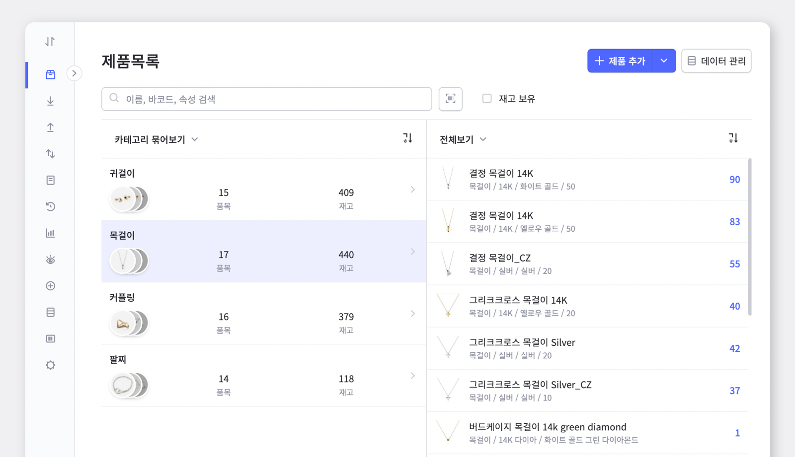
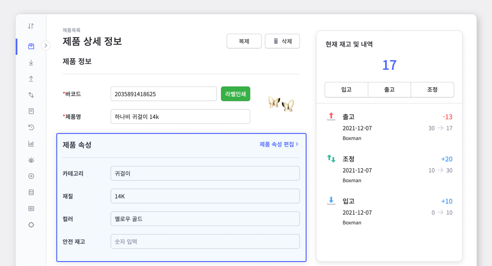
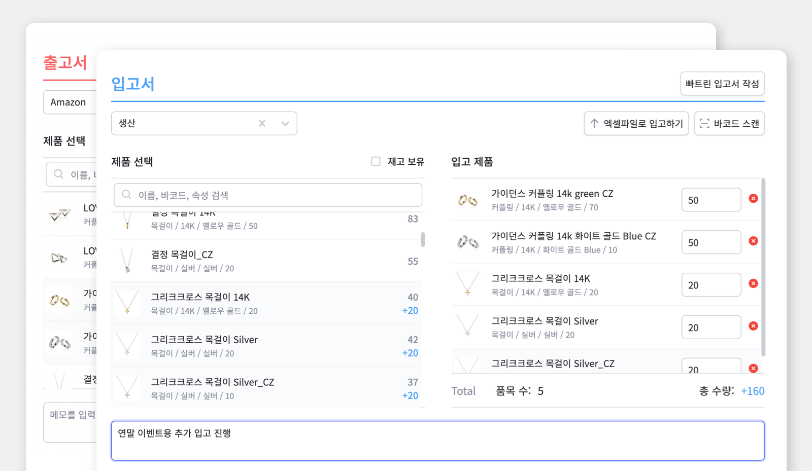
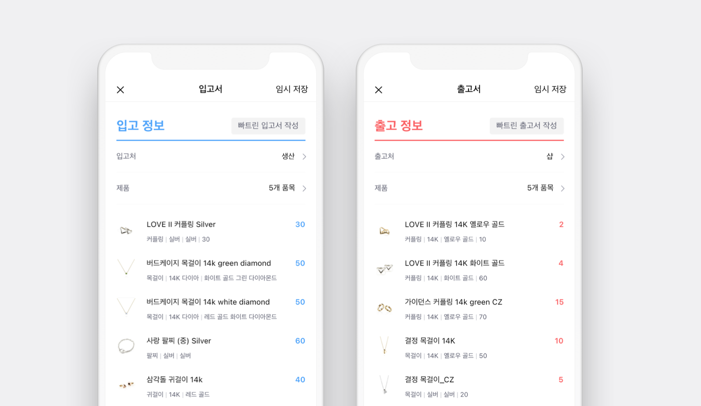
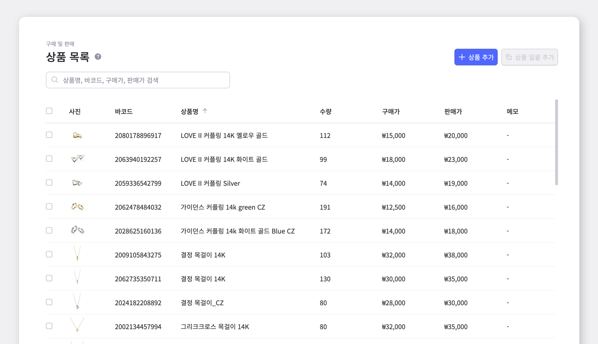
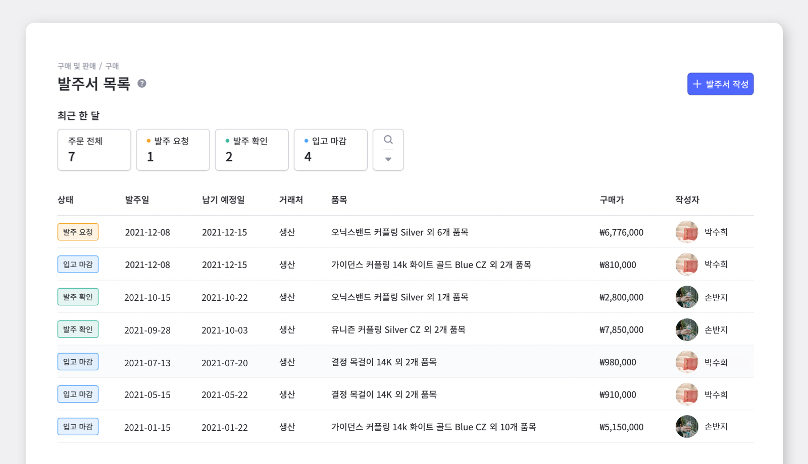
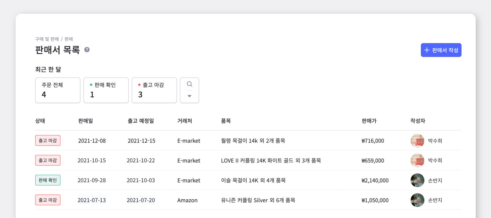
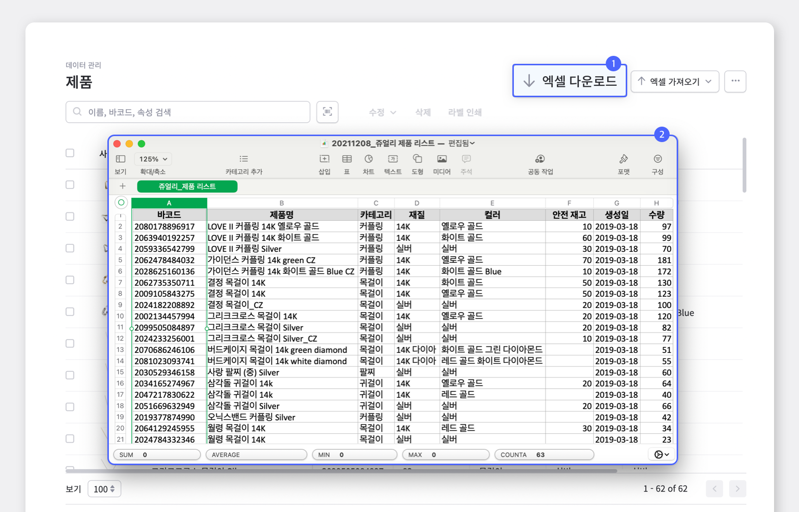
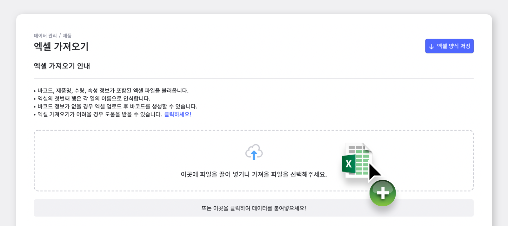
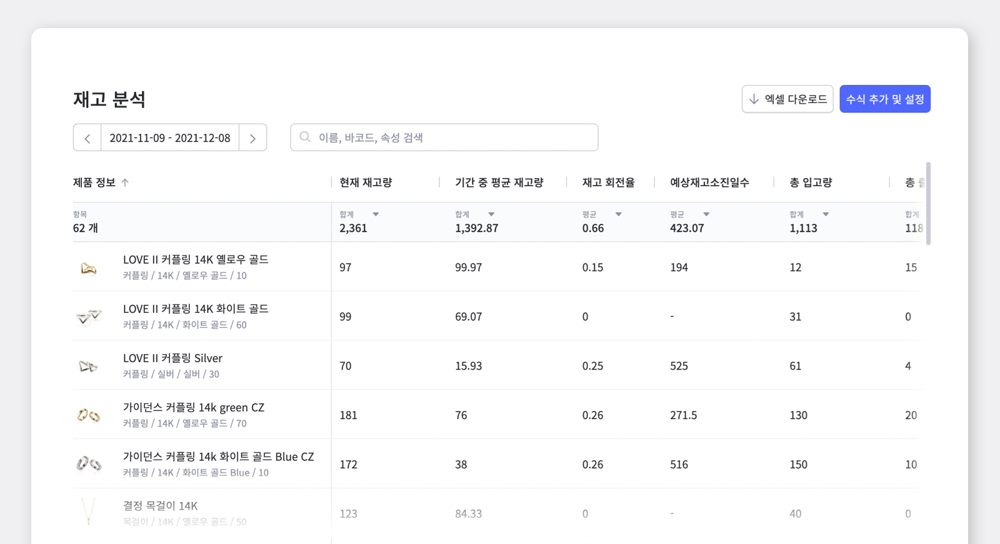

악세사리 사업에 있어서 재고관리는 참 중요합니다. 재고관리에 소홀한 사이, 갑자기 인기 상품의 재고가 바닥 났다면 고객과의 신뢰도도 떨어질 뿐더러 곧바로 수익에도 영향을 미치게 되겠죠?

악세사리 재고관리에 딱 맞는 관리 방법, 박스히어로와 함께 알아보겠습니다.

## 1. 다양한 분류법으로 세분화하는 제품 관리

악세사리 제품을 관리하다보면 재질, 디자인, 색깔 등 제품마다 다양한 조건들로 나뉘게 됩니다. 제품명에 모든 정보를 넣어 분류할 수도 있지만, 많은 제품을 관리하다보면 제품명만으로 재고 현황을 빠르게 파악하기는 쉽지 않습니다.

이런 문제를 해결하기 위해 박스히어로에서는 각 제품마다 속성을 입력하는 관리법을 권장합니다. 제품의 속성을 나누어 등록해두면 각 특성의 재고 상황 파악 뿐만 아니라, 재고회전율을 바탕으로 재발주점을 계산할 때에도 매우 유용합니다.

아래 예시와 같이 카테고리, 재질, 컬러 등 악세사리 특성에 맞는 속성을 입력하여 관리해보세요.

 

- **제품 정보에 기입된 속성 예시**

## 2. 상황에 따른 입출고 관리

- **PC ver |** 입/출고 및 거래서 작성하기

박스히어로에서는 `입고`, `출고` 메뉴를 통해 쉽게 입고서와 출고서를 작성할 수 있습니다. 작성된 모든 입고서와 출고서 내역은 `히스토리`에서 빠짐없이 확인해보세요.

 

- **모바일 ver |** 입/출고 및 거래서 작성하기

바쁜 이동 일정으로 PC를 이용한 박스히어로 사용이 어려우신가요? 박스히어로 모바일 앱에서도 내 재고 현황을 웹과 동일하게 확인할 수 있습니다. 팀원들과 실시간 공유도 가능해, 언제 어디서나 편리하게 재고관리도 할 수 있답니다.

## 3. 발주부터 출고까지 한번에!

박스히어로가 제공하는 `구매 및 판매` 기능에서는, 발주부터 출고까지 모든 과정을 한 곳에서 관리할 수 있습니다. 각 과정에 필요한 주문서들이 자동 생성되며, 데이터를 기반으로 한 매출 분석까지 가능합니다.

 

**1. `상품 목록` 상품 목록 추가하기**

상품 추가 시 제품별로 구매가, 판매가를 입력하시면 각 상품별 가격을 파악하기 쉬워질 뿐만 아니라, 가격이 입력된 다양한 주문서를 빠르게 작성할 수 있습니다.

**2. `구매` 발주>입고 과정**

모든 발주 내용은 발주서 목록에서 확인 가능합니다. 각 발주서의 현황을 **발주 요청, 발주 확인, 입고 마감** 세가지 상태로 빠르게 파악해보세요.

- **박스히어로 구매 과정**

발주서 작성(발주 요청) >  거래처 발주 확정 후 발주 확인 > 입고 상품 확인 후 입고 마감

<video src="images/img_8.mp4" style="width:100%" muted autoplay loop playsinline></video>
<invisible></invisible>

 

**3. `판매` 판매>출고 과정**

모든 판매 내용은 판매서 목록에서 확인 가능하며 **판매 확인, 출고 마감**으로 현황을 확인할 수 있습니다.

- **박스히어로의 판매 프로세스**

판매서 작성 > 출고 상품 확인 후 출고 마감

<video src="images/img_10.mp4" style="width:100%" muted autoplay loop playsinline></video>
<invisible></invisible>

## 4. 엑셀을 사용한 데이터 관리

지금까지 관리해온 엑셀 데이터를 이용해 박스히어로에 바로 적용할 수는 없을까? 외부 공유용 엑셀 자료는 언제 만들지? 엑셀 호환 문제로 걱정하지 마세요.

박스히어로에서는 **엑셀 다운로드 / 가져오기 기능**을 통해 간단하게 데이터 관리가 가능합니다.

- **엑셀 다운로드**

제품 리스트들은 바코드, 제품명 뿐만 아니라 각 세부 속성까지 한번에 엑셀로 다운로드 할 수 있습니다. 제품 내역을 외부로 공유해야 하거나 재고 데이터가 엑셀 형식으로 필요한 경우에도 편리하게 다운로드하여 관리해 보세요.

 

- **엑셀 가져오기**

평소에 엑셀로 재고를 관리 하셨다면 가지고 계신 엑셀 파일을 업로드하여 프로그램에 빠르게 적용 할 수 있습니다. 엑셀에 저장되어 있던 각 항목이 박스히어로의 속성과 일치하는지 확인하고 업로드 완료 버튼을 누르면, 한번에 등록 및 수정 됩니다.

<caution-box>

엑셀 가져오기 전에 제품 속성을 올바르게 설정 했는지 반드시 확인해주세요.

</caution-box>

## 한 눈에 보는 재고분석

`재고분석` 메뉴에서는 박스히어로에 쌓인 데이터를 바탕으로 다양한 재고 분석 정보를 제공합니다.

자주 활용하는 기본 수식은 자동으로 생성 되며, 원하는 분석 정보가 없을 경우 직접 수식을 입력해 분석 항목을 추가할 수 있습니다. 재고 분석 기능을 통해 계산하기 어려웠던 평균재고, 재고회전율 뿐만 아니라 매출액, 이익률 등 매출 정보와 함께 재고를 관리해보세요. 쉽고 정확한 재고 분석과 함께라면 당황스러운 품절 상황을 피할 수 있습니다.

### 이제 박스히어로와 함께 쉽고 정확하게 악세서리 재고관리하세요.

수많은 악세사리 재고관리에 어려움을 겪고 계신가요? 지금 바로 박스히어로를 시작해보세요.

박스히어로는 누구나 쉽게 사용할 수 있는 재고관리 특화 솔루션입니다.

다양한 재고관리 기능을 통해 업종 구분없이 모든 비즈니스에서 도입이 가능합니다.

 

<tip-box>

**박스히어로는 PC와 모바일, 모든 환경에서 사용할 수 있습니다.**

PC가 없는 환경에서도 재고관리는 멈추지 않고 계속됩니다.

강력한 모바일 앱을 지원해 스마트폰에서도 박스히어로를 사용할 수 있습니다.

</tip-box>

