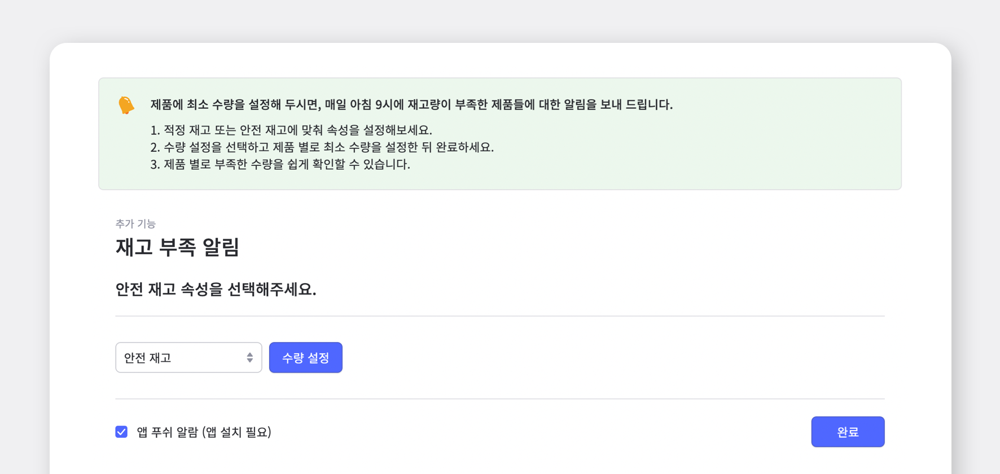

사업장을 운영해 보신 분이라면 '안전재고'의 필요성을 느끼셨을 거에요!

예상치 못하게 늘어난 수요는 어쩌면 사업 운영에 있어 희소식일지 모르지만, 갑작스러운 발주와 배송으로 인해 예상치 못한 비용이 발생할 수 있으며, 무엇보다 소비자의 불만이 쌓일 수 있어요.

안전재고를 사용하면 품목별 부족 수량을 쉽게 확인할 수 있으며, 안전재고 이하로 재고가 남을 경우 경고 메시지와 함께 위험한 상황에 대비할 수 있고 안전재고를 고려하여 발주 수량을 산출할 수 있습니다. 또한 업무를 자동화하는 시스템을 활용하여 재고가 부족한 상황을 놓치지 않고 미리 대비할 수 있어요! 

이번 게시물에서는 **박스히어로의 안전재고/재고부족 알림**에 대해서 알아보겠습니다!

## 부족한 재고 알림 설정하기

박스히어로의 안전재고 기능을 사용하면 부족한 재고에 대한 알람을 받을 수 있어요. **추가기능** 메뉴를 클릭한 후 **재고 부족 알림 탭**을 누르면 해당 기능을 이용할 수 있습니다.

먼저, 각 제품에 대한 안전재고는 어떻게 설정해야할까요?

### 1. 안전재고 설정하기

<video src="images/img_2.mp4" style="width:100%" muted autoplay loop playsinline></video>
<invisible>박스히어로 웹에서 속성 메뉴에서 안전재고 설정하기</invisible>

`제품목록` > `제품추가` > `제품 속성 편집` > `안전재고 추가`의 과정을 통해 제품의 속성에 안전재고 개수를 추가할 수 있습니다! 자세한 과정은 위의 gif 영상을 참고해주세요!

### 2. 안전재고 수량 설정/수정하기

<video src="images/img_3.mp4" style="width:100%" muted autoplay loop playsinline></video>
<invisible>박스히어로 웹에서 안전재고 수량 설정 또는 수정하기</invisible>

재고 부족 알림 탭을 클릭하면 **재고부족/재고부족임박/과재고** 에 해당하는 제품들을 한 눈에 살펴볼 수 있어요, 뿐만 아니라 각 제품마다 안전재고를 수정/설정할 수 있는 기능입니다!

<tip-box>

**부족한 재고** : 등록한 안전재고의 수와 같거나 적을 때

**과재고** : 등록한 안전재고의 수가 3배 이상 많을 때

</tip-box>

 

- **모바일 어플에서 안전재고 설정하기**

<video src="images/img_4.mp4" style="width:100%" muted autoplay loop playsinline></video>
<invisible>박스히어로 모바일 어플에서 안전재고 설정하기</invisible>

자, 이제 안전재고 수량을 설정했다면 재고 부족 알림 설정을 하는 방법을 알아볼까요?

### 3. 재고 부족 알림 설정하기

제품에 최소 수량을 설정해 두시면, 매일 아침 9시에 재고량이 부족한 제품들에 대한 알림을 보내드려요!

<gray-box>

1. 적정 재고 또는 안전 재고에 맞춰 속성을 설정해보세요.

2. 수량 설정을 선택하고 제품 별로 최소 수량을 설정한 뒤 완료하세요.

3. 제품 별로 부족한 수량을 쉽게 확인할 수 있습니다!

</gray-box>

 

- **모바일 어플에서 제품 정보 설정 및 재고부족 알림 설정하기**

박스히어로 모바일 어플에서도 간단하게 제품 정보 설정과 재고 부족 알림 설정이 가능합니다!

<video src="images/img_6.mp4" style="width:100%" muted autoplay loop playsinline></video>
<invisible>모바일 어플에서 제품 정보 설정 및 재고부족 알림 설정하기</invisible>

### 4. 아침 9시, 띵동!

이렇게 매일 아침 아홉시, 재고가 부족한 제품의 알림이 핸드폰 화면에 나타나게 될거에요!

<caution-box>

재고부족 알림을 받으시려면, 핸드폰에서 박스히어로 어플의 푸쉬 알람을 켜두셔야 해요!

</caution-box>

마찬가지로 **부족한 재고/재고 부족 임박/과재고**에 대한 제품 정보 리스트를 엑셀을 통해 보관이 가능합니다! 오른쪽 상단 엑셀 다운로드 탭을 이용하시면 바로 엑셀 파일로 변환하여 저장이 됩니다!

<video src="images/img_8.mp4" style="width:100%" muted autoplay loop playsinline></video>
<invisible>제품 정보 리스트 엑셀 저장</invisible>

## 박스히어로의 재고 부족 알림 기능을 사용해서 갑작스런 재고 부족상황에 완벽하게 대비해보세요!

박스히어로에는 다음과 같이 재고 부족 알림 기능을 통해 재고 부족 상황을 대비하기에 꼭 맞는 유용한 기능들이 포함되어 있습니다.

- 제품추가의 제품 속성 편집 기능에서 '안전재고'를 추가해보세요!

- 추가기능의 재고 부족 알림 기능을 통해 매일 아침 9시에 재고가 부족한 제품에 대한 알림을 받으실 수 있습니다.

- 재고부족/재고부족 임박/과재고에 해당하는 제품 정보 리스트를 엑셀로 다운로드하실 수 있습니다.

<tip-box>

**박스히어로는 PC와 모바일, 모든 환경에서 사용할 수 있습니다.**

PC가 없는 환경에서도 재고관리는 멈추지 않고 계속됩니다.

강력한 모바일 앱을 지원해 스마트폰에서도 박스히어로를 사용할 수 있습니다.

</tip-box>

