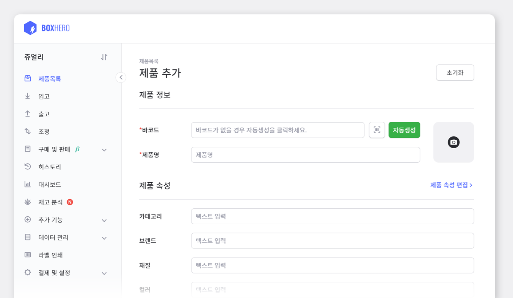
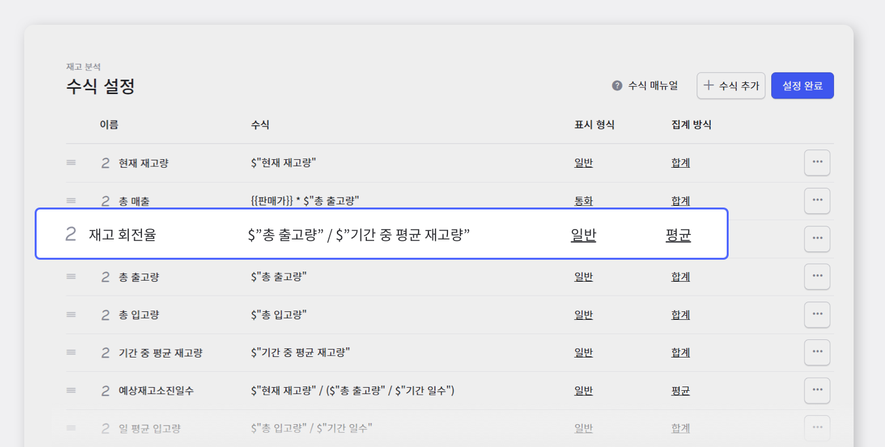
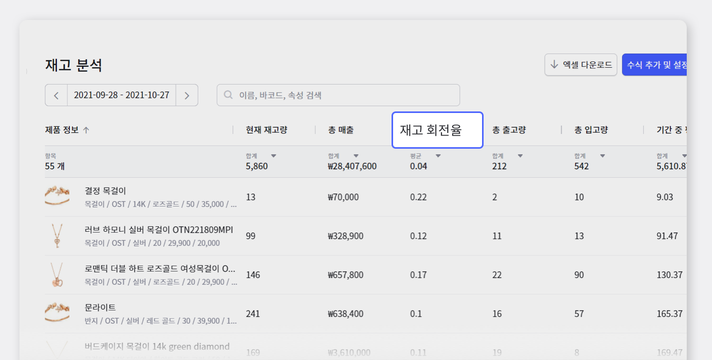

## 1. 재고 회전율 간단하게 짚어보기!

### 재고 회전율의 정의

재고 회전율은 일정 기간의 상품, 제품, 원재로 등의 출고량과 재고량의 비율을 가리키며, 이 가운데 재고량은 월평균 기초량 또는 기초와 기말의 평균 재고량에 의해 산출됩니다. <gray-text>(쉬운 예로, 1년에 약 몇 회 정도가 회전했는지를 나타내는 것으로서 500%라고 한다면, 1년간 재고가 5회전 했다는 것을 의미합니다.)</gray-text>

### 재고 회전율을 알면 어떤 점이 좋을까요?

일단, **재고 회전율이 높다는 것**은 그만큼 창고에 팔리지 못하고 쌓이는 물건이 많지 않다는 의미입니다. 이로 인해 재고 보관 비용을 줄일 수 있어, 자본 수익률은 높아진다는 장점을 가지고 있습니다. **반면에 재고 회전율이 낮아진다면** 가지고 있는 제품이 잘 팔리지 않고 창고에 쌓여가고 있는 상황을 의미합니다. 이러한 상황을 최대한 피하기 위해서는 최소한의 재고량과 최대의 재고 회전율을 갖도록 꾸준히 관리해야 합니다.

 

## 2. 박스히어로와 함께 재고 회전율을 구해봅시다!

**1. 제품 등록 :** `박스히어로 메인 페이지` > `제품 목록` > `제품 추가`

 

**2. 출고 진행하기 :** `출고` > `출고서` > `출고할 제품/수량 선택` > `출고 완료`

<video src="images/img_4.mp4" style="width:100%" muted autoplay loop playsinline></video>
<invisible>출고서  작성하기</invisible>

 

**3. 재고 분석에서 '재고 회전율' 수식 추가 :** `재고 분석` > `수식 추가` > `재고 회전율 수식 추가`

 

**4. 재고 회전율 확인 :** 재고 회전율 수식 추가 후 다시 재고 분석 페이지로 돌아가면 재고회전율에 대한 계산값을 확인하실 수 있습니다.

 

[더 읽어보기 : 재고 회전율을 활용하여 매출을 올리는 방법!](https://www.boxhero-app.com/ko/blog/posts/%EC%9E%AC%EA%B3%A0-%ED%9A%8C%EC%A0%84%EC%9C%A8%EC%9D%84-%ED%99%9C%EC%9A%A9%ED%95%98%EC%97%AC-%EB%A7%A4%EC%B6%9C%EC%9D%84-%EC%98%AC%EB%A6%AC%EB%8A%94-%EB%B0%A9%EB%B2%95)

재고 회전율에 관한 자세한 내용과 재고 회전율을 활용하여 매출을 최대치로 끌어올리는 방법에 대해 다룬 글입니다. 이번 포스팅과 함께 읽어 보시고, 재고 회전율에 대해 더 정확히 짚어보세요!

### 이제 박스히어로와 함께 쉽고 정확하게 재고관리하세요.

재고관리에 어려움을 겪고 계신가요? 지금 바로 박스히어로를 시작해보세요.

박스히어로는 누구나 쉽게 사용할 수 있는 재고관리 특화 솔루션입니다.

다양한 재고관리 기능을 통해 업종 구분없이 모든 비즈니스에서 도입이 가능합니다.

 

<tip-box>

**박스히어로는 PC와 모바일, 모든 환경에서 사용할 수 있습니다.**

PC가 없는 환경에서도 재고관리는 멈추지 않고 계속됩니다.

강력한 모바일 앱을 지원해 스마트폰에서도 박스히어로를 사용할 수 있습니다.

</tip-box>
