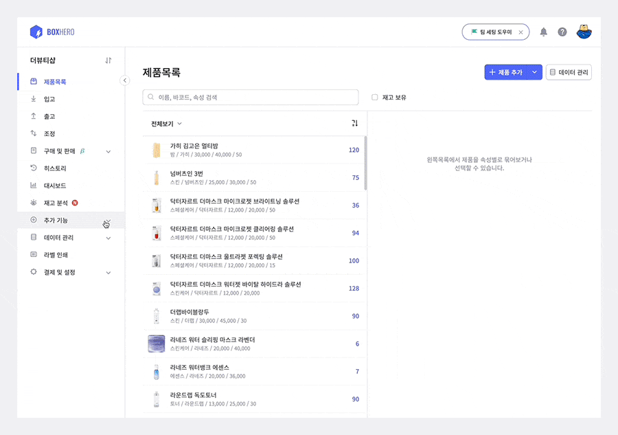
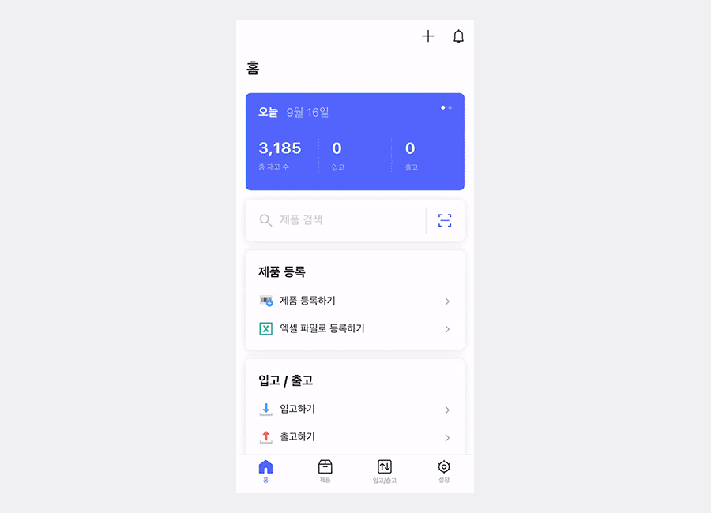
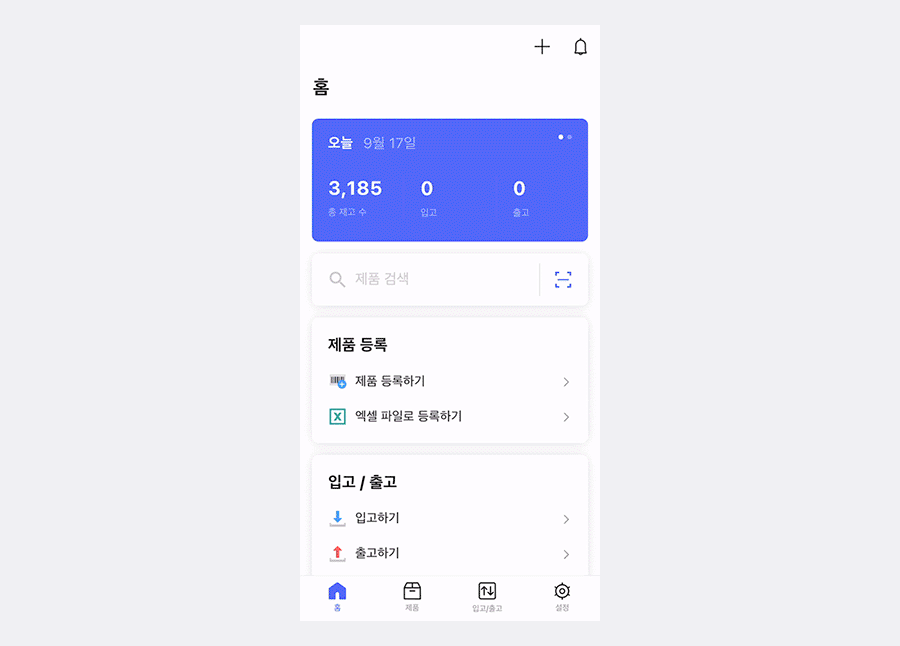
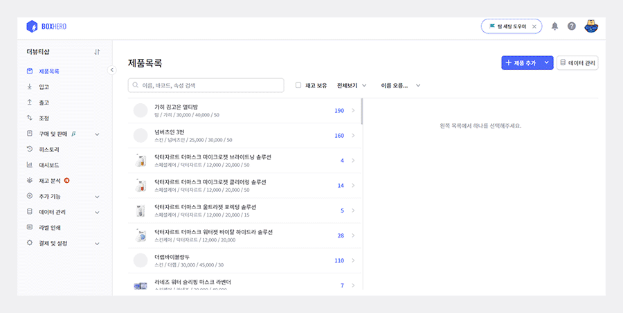
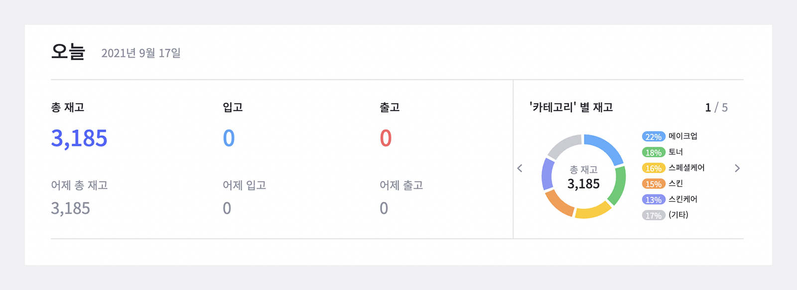
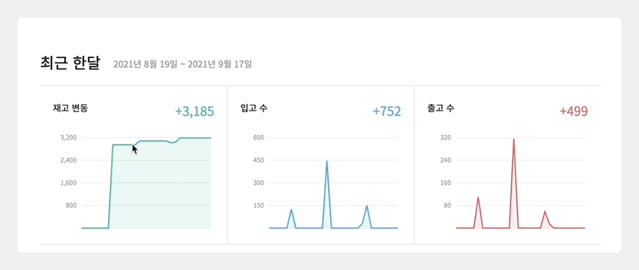
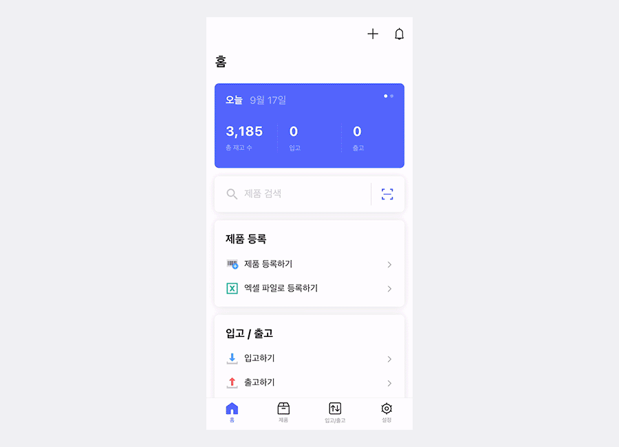

이번 게시물에서는 박스히어로의 숨겨진 추가 기능들에 대해서 알아보겠습니다!

입/출고 내역을 한 눈에 볼 수 있는 '입출고 요약' 기능부터, 모든 기록을 그래프로 확인할 수 있는 '대시보드' 기능까지! 사용방법부터 주의할 점까지 천천히 함께 알아볼까요?

## **입출고 요약**

박스히어로에서는 원하시는 기간을 설정하면 그 기간에 이루어진 모든 입/출고 내역을 요약하여 보여주는 '입출고 요약' 기능을 제공하고 있습니다.

물론 입출고 요약 리스트를 **엑셀 파일로 다운로드가 가능**합니다!

- **모바일 어플**

<tip-box>
모바일 어플에서는 따로 '입출고 요약' 이라는 메뉴가 없어요!
</tip-box>

하단 **입고/출고** 메뉴에서 날짜 필터를 적용해주시면 입/출고 내역 리스트를 확인하실 수 있습니다.

## **과거 수량 조회**

마찬가지로 과거에 거래했던 제품들의 수량을 확인 가능합니다. 제품 이름을 누르면 제품 정보 수정 뿐만 아니라 입고/출고 내역도 오른쪽 작은 화면으로 확인할 수 있어 편리한 기능입니다!

**현재와 과거의 재고 수량을 비교하고 싶을 때 수기로 계산할 필요 없이 한 눈에 비교가 가능합니다.**

- **모바일 어플**

## **대시보드**

대시보드에서는 제품의 입고 수, 출고 수 등을 그래프로 표현하여 빠르게 파악할 수 있도록 도와주는 기능입니다.

- **오늘/속성별 재고**

조회 날짜를 기준으로 오늘과 어제의 총 재고, 입고, 출고 수를 확인할 수 있으며,  좌측/우측에 보이는 화살표를 누르면, 속성별 재고를 한눈에 파악할 수 있습니다.

- **최근 한달 간의 재고/입고/출고 변동 확인하기**

마우스를 올리면 각 일자별 변동내역을 상세히 확인할 수 있습니다.

- **모바일 어플**

## 박스히어로의 추가 기능들과 함께 완벽한 재고관리에 도전하세요!

박스히어로에는 다음과 같은 추가기능들이 있습니다.

- 일자별로 입출고 내역 요약을 한 눈에 살펴볼 수 있습니다.

- 일자에 상관없이 사용 시작한 날짜부터 현재까지의 과거 입출고 내역을 열람하실 수 있습니다.

- 대시보드를 사용해 각 일자별 변동 내역을 그래프로 한 눈에 확인이 가능합니다.

<tip-box>

**박스히어로는 PC와 모바일, 모든 환경에서 사용할 수 있습니다.**

PC가 없는 환경에서도 재고관리는 멈추지 않고 계속됩니다.

강력한 모바일 앱을 지원해 스마트폰에서도 박스히어로를 사용할 수 있습니다.

</tip-box>

