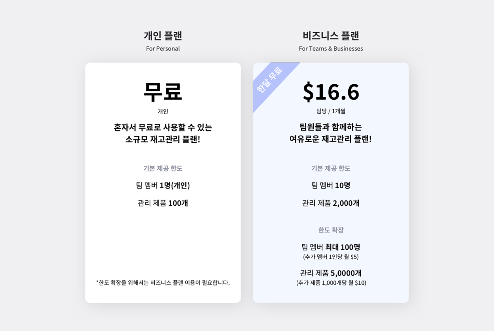
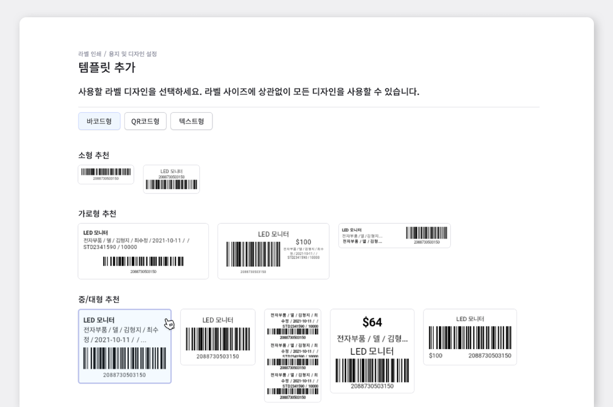
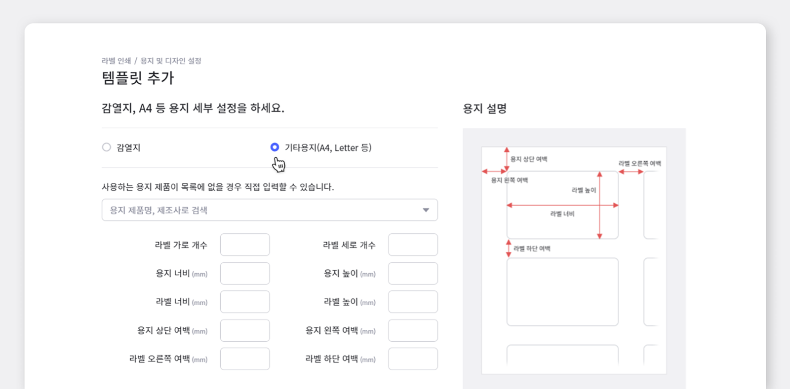
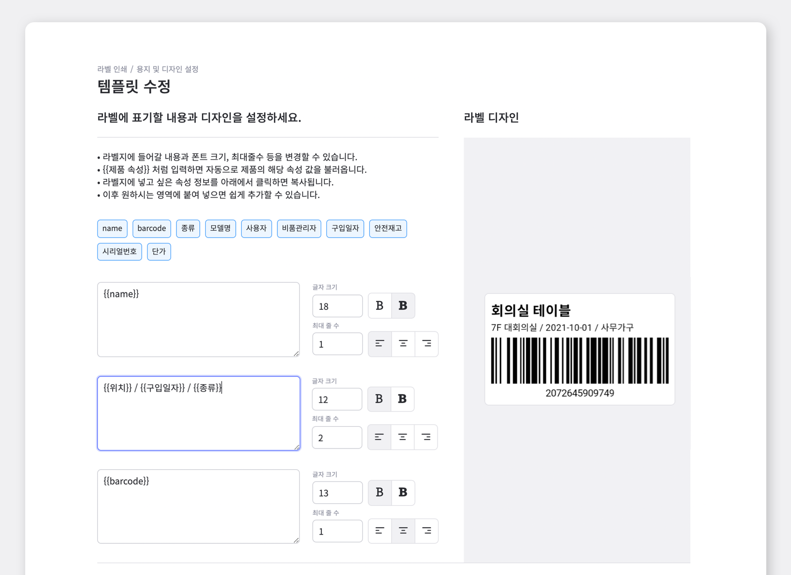
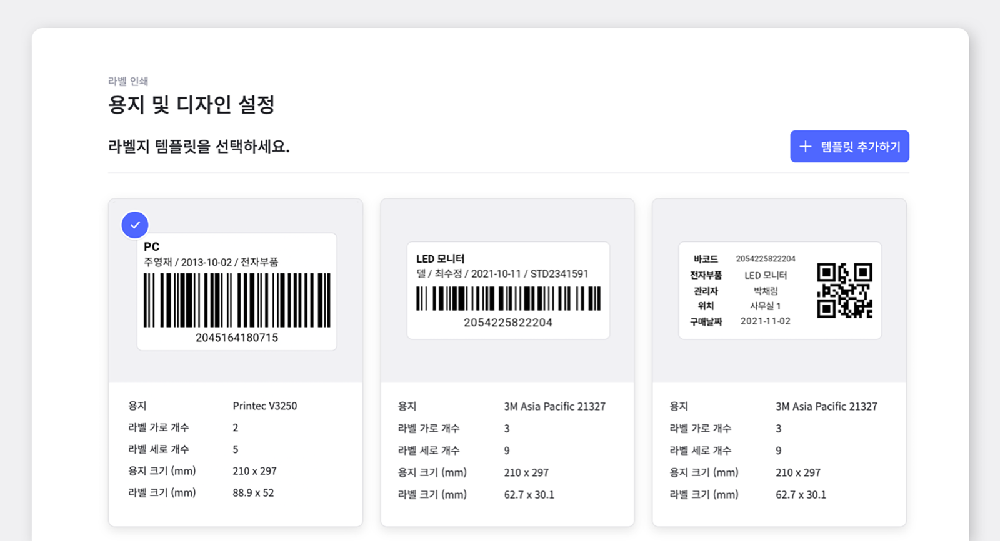
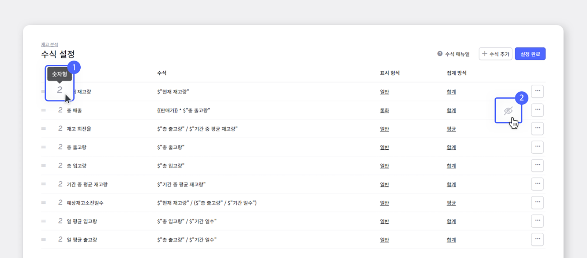
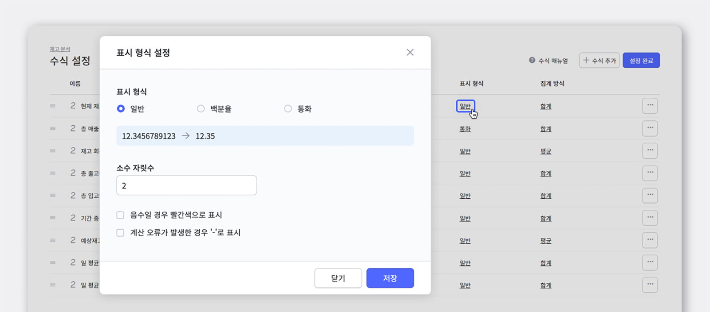
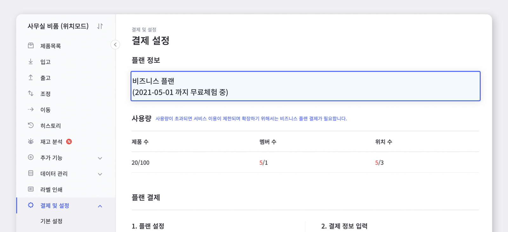

> "여러 팀원이 실시간으로 재고 상황을 공유하려면 어떤 재고관리 프로그램을 사용해야 적합할까요?"
> "체험판으로 사용해 볼 수 있으면 좋겠는데, 그런 프로그램이 있을까요?"

 

여기, 쉽고 정확한 판단으로 원활한 재고관리를 도와주는 박스히어로가 있습니다.

박스히어로는 체험판 이용 시 추가적인 결제 수단 등록이 필요하지 않아, 자동 결제에 대한 부담 없이 한 달간 비지니스 플랜을 무료로 사용하실 수 있답니다. 이번 게시글에서는 한달 무료 플랜을 이용하면서 놓치지 말아야 할 박스히어로 활용법을 소개해 드릴게요.

**회원 가입 후 바로 이용 가능한 한 달 무료 플랜으로 완벽한 재고관리에 도전해보세요!**

## 한 달간 무료로 누리는 여유로운 관리 한도

박스히어로 회원 가입 당일부터 **30일동안 비즈니스 플랜을 무료로 체험**해보실 수 있습니다.

비지니스 플랜에서는 팀 멤버 10명과 관리 품목 2,000개를 기본 제공하며, 추가적인 한도 확장을 원하실 경우 팀 멤버 최대 100명과 관리 품목 최대 50,000개까지 가능합니다. 
<gray-text>(한도 확장의 경우, 별도의 추가 금액이 발생합니다. 더 자세한 정보를 원하신다면 [요금 안내 페이지](https://www.boxhero-app.com/ko/pricing/)를 참고해주세요!)</gray-text>

 

<gray-box>

**무료 체험 기간이 끝난 뒤에는, 개인 플랜(무료 플랜)으로 자동 전환됩니다.** 
한 달 무료 체험 기간이 끝나면, 박스히어로에서 무료로 제공하는 개인 플랜으로 자동 전환되며 유/무료와 상관없이 기존에 입력한 데이터는 지워지지 않습니다. 전환 이후 현재 사용량을 개인 플랜에서 제공하는 한도에 맞게 조정해야 정상적인 서비스 이용이 가능하다는 점 주의해주세요.

**한 달 무료 체험을 하기 위해서는 결제 수단 등록이 필요하지 않습니다.**  
먼저 무료 체험 기간동안 충분히 사용해보시고 비즈니스 플랜으로 계속해서 서비스를 사용하고 싶을 경우에만 결제수단을 등록하시면 됩니다. 만약 체험 기간동안 결제수단을 등록하셨을 경우, 체험기간이 종료된 후에 비지니스 플랜으로 결제가 진행됩니다.

**플랜이 변경 되더라도, 등록해둔 항목은 절대 삭제 되지 않습니다.**

</gray-box>

## 마음에 드는 디자인으로 바코드 템플릿 제작

좀 더 정확한 재고관리를 위해서라면 꼭 필요한 바코드, 박스히어로에서는 바코드 디자인부터 생성, 인쇄까지 쉽고 빠르게 진행할 수 있습니다.

 

- **라벨 템플릿 선택**

박스히어로에서 제공하는 다양한 디자인의 바코드 템플릿을 사용성에 맞게 선택할 수 있습니다.

<tip-box>

제공되는 디자인 외 별도의 라벨 디자인이 필요한 경우 고객센터를 통해 연락주세요.

</tip-box>

 

- **라벨 용지 설정**

선택한 템플릿은 용지 세부 설정에서 일반 용지, 혹은 감열지를 선택해 라벨지 세팅이 가능합니다. 다양한 제조사의 용지 설정이 적용되어 있어 클릭만으로 간단하게 용지 설정을 완료할 수 있습니다.

사용하는 용지 제품이 목록에 없는 경우, 직접 라벨지 규격을 직접 입력하여 이용하면 됩니다.

 

- **라벨 표기 내용 설정**

라벨지 설정이 끝났으면 다음은 라벨에 표기할 내용을 설정할 차례입니다! 라벨에 들어갈 파란 색 박스의 속성 값을 클릭하면 자동으로 복사가 됩니다. 해당 값을 원하는 영역에 붙여넣기 하여 오른쪽의 미리보기를 통해 쉽게 내가 원하는 대로 제작할 수 있습니다.

 

- **라벨 최종 확인 후 저장 및 인쇄**

최종적으로 완성된 디자인을 검토한 후 저장하면 라벨 디자인이 완성됩니다. 저장된 라벨 템플릿은 언제든 사용 할 수 있어 번거로운 재설정 과정을 줄일 수 있답니다. 완성된 디자인을 설정하신 라벨 용지에 맞게 인쇄하시면 바코드 라벨 제작 과정이 완료됩니다!

<caution-box>

라벨 디자인과 출력 기능은 현재 PC 웹 버전에서만 사용이 가능합니다.

</caution-box>

## 복잡한 수식 계산, 박스히어로가 대신해 드릴게요!

효과적인 재고관리를 위해서는 관리하고 있는 재고에 대해 명확하게 파악하는 것이 매우 중요합니다. 적정한 재고 수준을 유지하기 위해서 재고분석이 필수라는 것을 알지만, 막상 해보려니 어렵게 느껴지시나요? 걱정마세요. 박스히어로는 어렵고 번거로운 재고 분석을 쉽게, 그리고 정확하게 해결해 드립니다.

박스히어로의 재고분석 기능, 함께 살펴볼까요?

 

<video src="images/img_7.mp4" style="width:100%" muted autoplay loop playsinline></video>
<invisible></invisible>

 

재고분석 기능에서는 기간에 따른 현재 재고량, 총 매출, 재고 회전율, 총 출고량 등 다양한 분석 항목을 자동으로 계산하여 한 눈에 보기 쉽게 표로 제공하고 있습니다. 물론 이 모든 정보들은 엑셀로 다운 받아 보관이 가능합니다.

기본적으로 박스히어로가 제공하는 정보 외에 다른 분석이 필요하다면, 직접 수식을 추가하여 맞춤형 관리도 가능합니다.

<caution-box>

단, 매출 관리를 하기 위해서는 원가, 판매가 등을 속성으로 관리하고 있어야 합니다. 관련 항목이 없다면 `데이터 관리` > `속성` 에서 항목을 추가 후 제품별 정보를 먼저 입력해주세요.

</caution-box>

 

- **수식 설정**

`재고분석` > `수식 추가 및 설정`에서 저장되어 있는 수식을 확인, 수정 및 삭제할 수 있습니다.

1. 각 이름 옆 아이콘에 마우스를 올리면 수식 타입을 알 수 있습니다.
2. 숨김 이모티콘을 이용해 재고 속성 표에서 원하시는 데이터를 안 보이게 가릴 수 있습니다.

 

- **표시 형식 설정**

**일반 / 백분율 / 통화**로 표시 형식을 설정 할 수 있습니다. 원하는 분석값 형식에 맞게 선택해보세요.

## 한 달 무료 체험, 만료일 이후는 어떻게 되나요?

`결제 및 설정` - `결제 설정` 상단에서 운영중인 팀의 무료 체험 만료일을 확인해 보세요.

무료체험 만료 후, 현재 사용하고 있는대로 계속 사용하고 싶을 경우 예상 가격이 궁금하시나요? 
결제 및 설정에서 원하는 플랜의 가격을 바로 확인하실 수 있습니다.

<video src="images/img_11.mp4" style="width:100%" muted autoplay loop playsinline></video>
<invisible>한도 확장 후 예상 가격 알아보기</invisible>

### 재고관리에 어려움을 겪고 계신가요? 지금 바로 박스히어로를 시작해보세요.

박스히어로는 누구나 쉽게 사용할 수 있는 재고관리 특화 솔루션입니다.

다양한 재고관리 기능을 통해 업종 구분없이 모든 비즈니스에서 도입이 가능합니다.

**이제 박스히어로와 함께 쉽고 정확하게 재고관리하세요.**

 

<tip-box>

**박스히어로는 PC와 모바일, 모든 환경에서 사용할 수 있습니다.**

PC가 없는 환경에서도 재고관리는 멈추지 않고 계속됩니다.

강력한 모바일 앱을 지원해 스마트폰에서도 박스히어로를 사용할 수 있습니다.

</tip-box>

