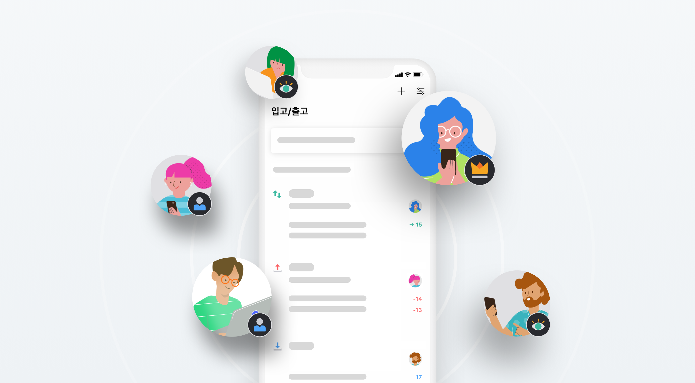
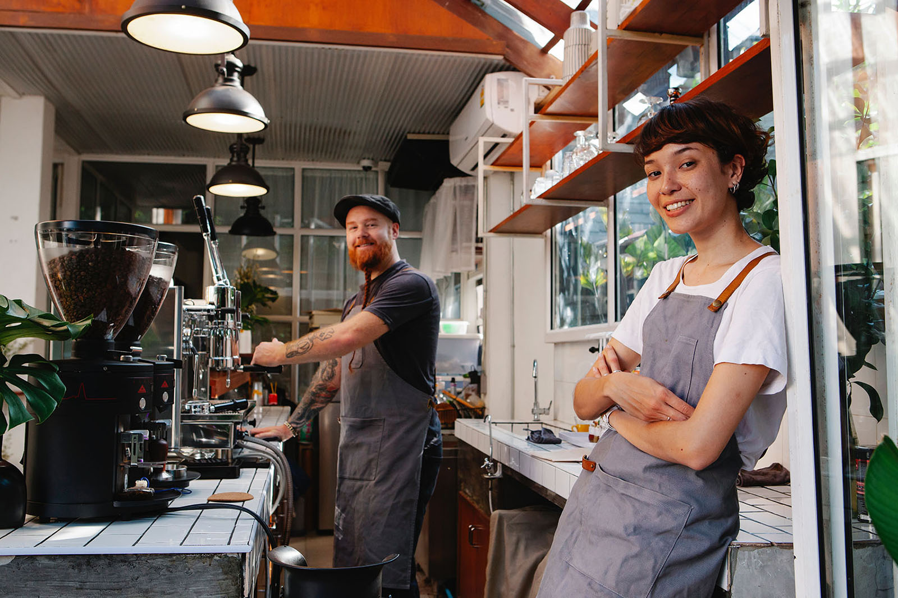

## 사장님! 커피는 있는데..컵이 없어요

카페를 운영하면서 제일 신경써서 철저하게 관리해야 할 부분은 무엇일까요?

바로 재고관리입니다. 카페를 이용하는 분들이 관리 부실로 인해 상한 식자재를 섭취하거나 그로 인해 문제가 생기면 큰일이겠죠? 또한 재료 또는 소모품의 소진은 고객 불만족으로 이어질 수 있고, 단골 고객을 잃거나 수익 하락으로 끝날 수 있는 위험이 다분합니다. 더군다나 카페는 주로 파트타임 직원들로 이루어져 지속적인 재고 관리나 현황 공유가 어렵다는 특징도 있습니다. 그러므로 카페에서는 체계적인 재고관리 시스템이 꼭 필요합니다!

카페에서 재고관리 하는 방법이라고 하면 먼저 **'선입선출'**을 떠올리실텐데요. 여기서 선입 선출이란 '**F**irst **I**n **F**irst **O**ut' , 'FIFO' 말 그대로 먼저 입고 된 상품을 먼저 출고한다는 의미입니다. 보통 이 선입선출의 원칙은 일반적으로 제품의 재고 회전율이 낮은 경우에 많이 적용되는 방법입니다. 음료, 빵, 케잌 등 선입선출이 꼭 필요한 제품들을 판매하는 카페에서 꼭 필요한 방법이겠죠? 특히 유제품의 경우 비교적 짧은 유통기한으로 인해 들어오고 나가는 물량이 빠듯합니다. 이처럼 빠듯한 입출고 순환 상품의 경우 소진된 수량만 입력하면 임박한 유통기한 순으로 출고서를 작성해주는 ‘엑셀 선입선출’을 활용할 수 있습니다. 일일이 제품과 유통기한을 확인해 수량을 넣지 않아 업무 효율성을 증가시킬 수 있습니다.

카페에서 관리해야할 부분 중에 식자재를 제외하고도 많은 유형의 재고들이 있습니다! 예를 들어 커피를 담는 컵, 테이크 아웃에 필요한 컵 캐리어, 고객님들이 사용하는 티슈, 음료수 제조에 필요한 시럽 등이 있는데요, 많고 다양한 유형의 재고들을 한번에 관리하기 당연히 쉽지 않겠죠? 또한 재고 관리 시기를 놓칠 수도 있습니다.

이번 글에서는 카페에서 재고를 관리하는 **5가지 효과적인 방법**을 소개해 드리겠습니다!

## 1. 클라우드 기반 시스템 사용

종이나 엑셀을 통해 재고 데이터와 현황을 관리하고 공유하는 것은 어렵고 불편합니다. 혹시라도 변경사항이 생겨 수정작업을 하면 실시간으로 공유할 수가 없기 때문에 그로 인해 직원들에게 혼란을 줄 수 있습니다.

클라우드 기반 재고관리 프로그램을 사용하면 모든 데이터가 실시간으로 공유되기 때문에 모든 직원이 PC 또는 스마트폰을 통해 직접 액세스할 수 있습니다. 그럼 재고가 변경되면 모든 데이터가 즉시 업데이트되어 모든 직원이 실시간으로 데이터를 공유할 수 있겠죠?

또한 여러 직원, 알바생들과 엑셀, 심지어는 수기로 재고 관리하기란 쉽지 않습니다. 다양한 사람과 실시간으로 재고 현황을 업데이트 받을 수 있는 클라우드 관리 시스템을 이용해보세요. 예를 들어, 클라우드 서비스를 사용하면 재고 관리 담당자가 PC로 현황을 입력하면 다른 직원들은 모바일로 실시간 확인할 수 있어 착오없이 유통기한 임박 순으로 재고 소진을 할 수 있습니다!

## 2. 재고 분류

카페에서는 꼭 주기적으로 관리해야 하는 식자재 뿐만 아니라 다양한 유형의 재고 관리가 필요하기 때문에 재고를 분류하는 작업은 매우 중요합니다.

예를 들어 ‘종류’, ‘계량’, ‘거래처’, ‘유통기한’ 등 해당되는 종류에 맞춰 미리 분류해두면 각 분류에 따라 현재 재고 상황, 금주 소진된 재고량, 임박한 유통기한 등 다양하게 볼 수 있습니다. 이로써 품목 분류를 쉽게 할 수 있을 뿐만 아니라 우유, 요구르트 등과 같이 특별 취급이 필요한 식자재들을 보다 쉽게 확인하고 관리할 수 있습니다.

## 3. 예상 재주문 품목

재고 분석을 수행하면 현재 입/출고 상태를 추적하는 데 유용할 뿐만 아니라 다음 달의 제품 주문 사항을 예측할 수 있습니다. 지난 달의 재고 내역을 꼼꼼하게 확인하고 다음 주문 시 참고하세요! 또한 주기적으로 재고를 분석하면 고객의 요구 사항을 더 잘 이해할 수 있을 뿐만 아니라 불필요한 주문을 피할 수 있습니다.

## 4. 안전 재고 파악

사업을 하다 보면 항상 실시간으로 재고 확인을 할 수는 없습니다. 그러나 특히 고객이 특정 제품을 필요로 할 때 재고 부족 현상이 일어나면 곤란해지는 상황을 대비하기 위해서는 꼭 필요한 작업입니다!재고 확인의 주요 목적은 최적의 재고 수준을 유지하는 것입니다. 안전 재고를 미리 파악해두면 재고를 매번 확인하지 않아도 되므로 많은 시간과 노력을 절약할 수 있습니다.

## 5. 악성 재고

매장에 남는 재고가 너무 많거나 판매되지 않고 자리만 차지하는 제품들이 있나요?

이런 악성 재고는 시간이 지날수록 가치가 떨어지는 반면 공간만 차지하기 때문에 관리가 꼭 필요합니다. 일단 현재 매장에 보유하고 있는 여러가지 유형의 재고들 중 악성 재고를 따로 분류하고 파악하는 것이 중요합니다! 그 다음 기간별로 입/출고 및 재고 현황을 정리하면 악성 재고를 효율적으로 관리할 수 있습니다. 그럼 악성재고를 어떻게 하면 낭비하지 않고 좀 더 효과적으로 활용할 수 있을까요?

제일 기본적인 방법은 그러한 악성재고를 따로 분류해 먼저 활용/판매하는 것 입니다.

또 다른 방법으로는 그냥 두면 낭비할 수 있는 제품들을 무료로 고객들에게 제공함으로써 악성 재고 낭비를 피하고 매출도 올릴 수 있을 뿐만 아니라 마케팅 효과도 톡톡히 누릴 수 있습니다! 이게 바로 일석이조겠죠?

---

## 박스히어로와 함께라면 효율적인 카페 재고 관리가 가능합니다.

박스히어로에는 다음과 같이 카페 재고관리에 꼭 맞는 유용한 기능이 포함되어 있습니다.

- 카테고리, 용량 등 필요에 따라 제품을 분류해 맞춤 관리할 수 있습니다.
- 재고 분석 기능은 재주문을 위해 재고를 확인하는 데 도움이 됩니다.
- 재고 부족을 정확하게 파악하여 재고 수준을 최적으로 유지할 수 있습니다.
- 과재고를 신메뉴로 극대화해서 재고 낭비를 줄일 수 있습니다.

<tip-box>

**박스히어로는 PC와 모바일, 모든 환경에서 사용할 수 있습니다.** 
PC가 없는 환경에서도 재고관리는 멈추지 않고 계속됩니다. 
강력한 모바일 앱을 지원해 스마트폰에서도 박스히어로를 사용할 수 있습니다.

</tip-box>
