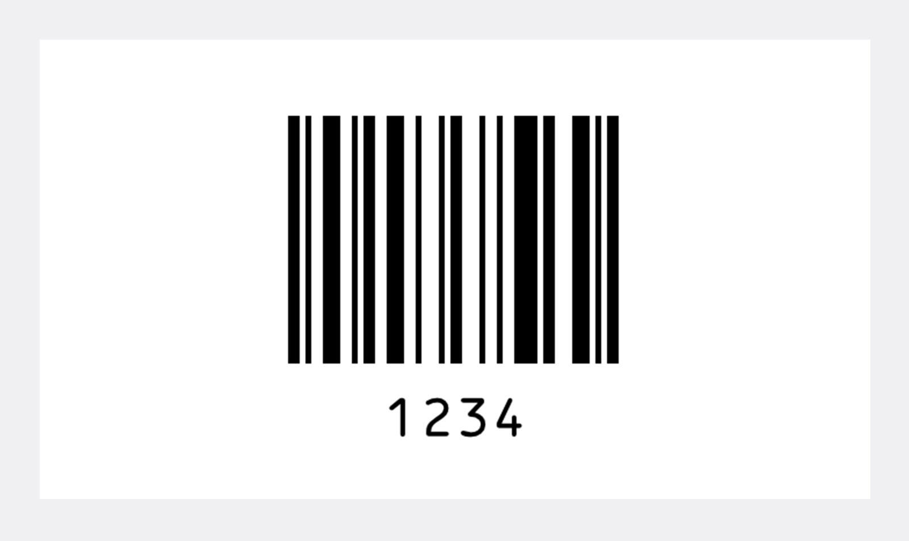
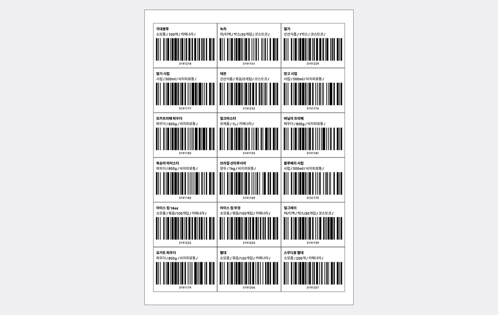

우리는 편의점이나 마트에서 쇼핑할때 나도 모르게 바코드를 자주 접하게 됩니다. 물건을 고르고, 계산대에 가져가면 직원분이 바코드를 스캔해서 총 얼마인지 알려줍니다. 우리가 소비하는 거의 모든 제품에는 바코드가 이미 붙어 있습니다. 이러한 바코드는 어떻게 만들어지는지, 내가 만든 제품에 바코드를 부착하려면 어떻게 해야 하는지 알아보겠습니다.

## 바코드는 왜 필요한가?

왜 모든 리테일 매장에서 바코드를 이용해서 계산을 할까요? 그 이유는 "효율성"입니다. 계산대에서는 최대한 빠르게 계산을 정확히 해야 하는데, 바코드가 없다면 어떤 제품이 몇개 있는지 눈으로 갯수를 세야합니다. 문제는 마트나 편의점에 일하는 분들이 수천가지의 제품을 다 외울수도 없을뿐더러, 아주 비슷하게 생긴 제품이 많아 사람의 눈으로 제품을 구분하기 어렵습니다. 

## 바코드 = 제품을 구분하기 위한 표식

제품의 바코드를 보면 우리가 알수 없는 숫자가 8글자~13글자로 표현되어 있습니다. 이 바코드 숫자 의미는 단순히 구분하기 위한 숫자입니다. 내가 동일하게 취급하고 싶은 제품에는 같은 숫자를 써 붙여 놓는다고 상상해보세요.

예를 들어 모든 코카콜라 500ml 캔에는 "1" 이라는 숫자를 쓰고, 모든 스프라이트 500ml 캔에는 "2"라고 써두는것과 같습니다. 이미 코카콜라 500ml 캔에 "1"이라는 숫자를 써두었다면, 350ml 캔에는 "3"이라는 새로운 숫자를 부여합니다.

이렇게 구분하기 제품의 종류를 구분하기 위한 용도 써둔 숫자로 이해하면 되고, 이 숫자가 13자리나 되는것은 전세계적으로 제품의 종류가 엄청 많기 때문입니다. 13개의 숫자로 된 바코드는 10조(10,000,000,000,000)개의 제품 종류를 표현할 수 있습니다.

바코드에 제품이름 등 추가 정보가 포함되어 있을거라고 착각하곤 합니다. 하지만 바코드는 단순 숫자일뿐 아무런 정보가 포함되어 있지 않습니다.

## 바코드 인식

제품마다 단순히 숫자를 써 붙여놓는 게 아니라 검은색 줄로된 "바코드"의 형태로도 붙여두는 이유는 기계가 빠르고 정확하게 인식할수 있기 때문입니다. 사람은 바코드 하단에 있는 숫자 1234를 쉽게 읽을수 있지만 "바코드"를 눈으로 보고 그 내용을 이해할수 없습니다. 반대로 기계는 숫자 1234를 정확하게 읽을수 없지만, "바코드"를 센서로 읽어내면 빠르고 정확하게 읽어낼수 있습니다.

아래쪽 숫자 "1234"는 사람이 읽기 위해서 써둔 숫자이고, 그 위에 있는 바코드는 "1234"를 기계가 읽기 편하도록 만들어둔 것입니다.

## 바코드 도입 이유

내가 제빵을 좋아해서 빵을 만들어서 판매하기 시작했다고 가정해보겠습니다. 처음에는 빵의 종류가 5가지 정도만 있어서 내가 어떤 빵인지 눈으로 보고 가격을 암산해서 계산할수 있습니다. 장사가 점점 잘되어 빵 종류가 100가지로 늘어났습니다. 

이제는 더 이상 내가 눈으로 보고 빵의 가격을 암산할수 없는 상황이 되었습니다.

빵을 만들때마다 포장지에 바코드 스티커를 붙여 둔다면, 계산할때는 빵 봉지에 붙어 있는 바코드만 스캔하여 총 금액을 계산할 수 있습니다. 내가 굳이 암산을 할 필요도 없고, 암산하는것보다 훨씬 정확하게 계산할 수 있습니다. 바코드 스캔만 하면 되기 때문에 나 대신 다른 사람이 계산해줄수도 있습니다.

## 바코드를 만드는 방법

위에서 바코드는 단순히 기계가 제품을 구분하기 위한 단순 "숫자"에 불과하다고 이야기 했습니다. 그럼 내가 만든 빵에 어떤 숫자를 부여하는게 좋을까요? 100가지 종류의 빵이 있으니 1번 부터 100번까지 부여하는것도 한가지 방법입니다. 또는 그냥 랜덤으로 숫자를 만들어서 부여해도 좋습니다.

바코드는 기계가 숫자를 읽기 위한 수단에 불과하기 때문에 내가 어떤 숫자로 부여하든 상관 없습니다. 대신 내가 만든 빵을 마트에 납품하여 판매할 계획이라면, 해당 마트에서 권고하는 숫자 규칙으로 부여해야 합니다. 예를들어 쿠팡 로켓배송으로 납품하는 제품에는 PL00000000000 와 같은 바코드번호를 부여해야 합니다.

## 바코드 인쇄하는 방법

바코드를 인쇄하는 가장 빠르고 쉬운 방법은 박스히어로를 이용하는 방법입니다. 박스히어로의 바코드 인쇄 기능을 이용하면 1분 이내로 바코드 생성부터 바코드를 인쇄할 수 있습니다. 이미 10개 이상의 바코드 라벨 템플릿을 제공하고 있으며, 내가 원하는 모양, 원하는 크기로 프린트 할 수 있습니다. 

박스히어로에서는 감열 프린터 뿐 아니라 일반 프린터(잉크젯, 레이져)로도 인쇄가 가능합니다. 시중에 파는 A4 라벨 스티커 용지만 구매하여 프린터에 넣고 인쇄하면 됩니다.

## 바코드 시스템을 도입해보세요.

바코드 시스템의 효율성은 이미 검증되어 리테일, 의료, 제조 등 거의 모든 분야에서 사용중입니다. 바코드 스캐너, 프린터, 스티커 용지 등 도입에 필요한 장비 또한 저렴하여 누구나 부담없이 도입이 가능합니다. 

바코드 시스템 도입의 첫 단추는 제품에 바코드 스티커를 제작하여 붙이는 것입니다. 한번만 바코드를 붙여두면 입고 시, 출고 시, 재고 조사 시 수반되는 시간을 단축할 수 있습니다. 또한 내가 납품한 거래처에서도 빠르고 정확하게 입고/출고 처리가 가능하니 유통 과정 전반적으로 높은 경제적 이득을 얻는다고 볼수 있습니다.

---

## 혹시 이제 막 재고관리를 시작하시는데 어려움을 겪고 계신가요?

박스히어로를 사용하시면 빠르게 바코드를 생성, 프린트하여 바코드 시스템을 도입할 수 있습니다. 휴대폰 앱을 통해 바코드 스캐너 기능을 제공하기 때문에 별도 바코드 스캐너 장비를 구매하지 않아도 됩니다.

**이제 박스히어로와 함께 쉽고 정확하게 재고관리하세요.**

<tip-box>

**박스히어로는 PC와 모바일, 모든 환경에서 사용할 수 있습니다.** 
PC가 없는 환경에서도 재고관리는 멈추지 않고 계속됩니다. 
강력한 모바일 앱을 지원해 스마트폰에서도 박스히어로를 사용할 수 있습니다.

</tip-box>

