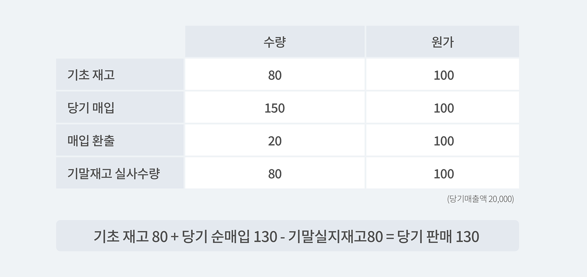
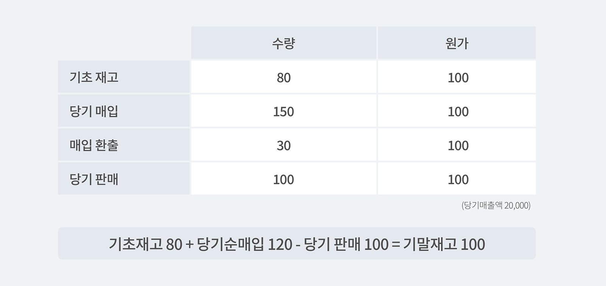
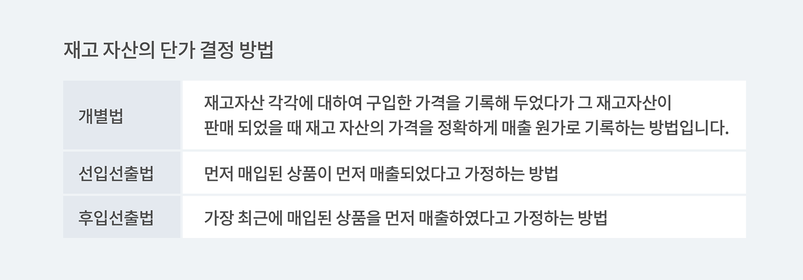

저번 포스트에서는 재고자산에 대한 정의, 재고자산의 종류와 취득원가/매출원가에 대해서 알아보았습니다. 이번 글에서는 재고자산의 수량/단가를 결정하는 방법과 기말 평가 방법에 대해서 알아보겠습니다!

### 1. 재고 자산의 수량을 결정하는 방법

재고 자산의 수량을 결정하는 방법으로는 크게 실지재고조사법과 계속 기록법으로 구분할 수 있습니다. 실지재고조사법이란 보고기간 말에 창고를 조사하여 기말재고수량을 파악하고 판매가능 수량 중 기말재고수량을 제외한 나머지의 수량은 판매된 것이나 사용된 것으로 간주하는 방법입니다. 이 방법은 재고자산의 종류, 구격, 수량이 많을 경우 입고/출고 시마다 이를 기록하는 번거로운 상황을 피할 수 있지만 도난, 분실 등에 대한 감소량이 당기의 출고량에 포함되어 재고부족의 원인을 알아내기가 어려우므로 관리와 통제를 한 번에 할 수 없다는 단점이 있습니다.

실지재고조사법은 정기적인 재고실사를 통해 기말재고수량을 파악하여 판매가능수량(기초재고+당기매입재고)과의 차이를 모두 판매된 수량으로 간주하는 방법입니다.

<tip-box>**실지재고조사법으로 보는 당기판매 = 기초재고 + 당기매입 - 기말실지재고**</tip-box>

- **실지재고조사법의 예시**

예를 들어 당기매출액을 20,000이라고 보았을 때, 

<invisible>
기초 재고/당기 매입/매입 환출/기말재고 실사수량/원가
</invisible>

계속 기록법은 기초재고에 당기에 재고자산이 매입 또는 제조될 때마다 계속해서 더하고, 당기에 재고자산이 판매될 때마다 계속해서 빼서 기말에 남은 재고자산을 기말재고자산으로 결정하는 방법입니다.

요약하자면 계속 기록법은 매출이 발생할 때마다 인식하는 방법으로 매출 수량을 통해 기말재고수량을 결정하게 됩니다. 정확하게 파악이 가능하다는 장점이 있지만 그만큼 비용이 많이 들기 때문에 효율성보다 비용이 상대적으로 많이 클 때에는 문제가 될 수 있습니다. 또한 계속 기록법을 통해 관리를 하면 언제든지 재고 자산 및 매출원가계정의 잔액을 알 수 있기 때문에 재고자산의 계속적인 통계적 관리가 가능합니다. 단 도난, 분실에 의한 감소량이 기말 재고량에 포함되어 이익이 과대계산이 될 소지가 있습니다.

- **재고조사법의 예시**

예를 들어 당기매출액을 20,000이라고 보았을 때, 

<invisible>
기초 재고/당기 매입/매입 환출/기말재고 실사수량/원가
</invisible>

기초재고 80 + 당기순매입 120 - 당기 판매 100 = 기말재고 100 으로 계산이 가능합니다.
여기서 당기 순매입은 당기 매입에서 매입 환출을 뺀 방법으로 구할 수 있습니다.

### 2. 재고 자산의 단가 결정 방법

재고 자산의 단가 결정 방법은 물량 흐름과 원가 흐름(재고 자산 취득 시기에 따라 재고 자산의 구입 단가가 계속해서 변동하는 경우 재고자산이 어떤 순서로 팔리는지를 가정)을 파악하기 위한 것으로 크게 개별법, 선입 선출법, 후입 선출법을 나눌 수 있습니다. 

**① 개별법** 

재고자산 각각에 대하여 구입한 가격을 따로 기록해 두었다가 그 재고가 판매되었을 때 그 재고자산의 구입가격을 매출원가로 기록하는 방법입니다. 개별법은 원가의 흐름과 실물의 흐름이 일치하는 가장 이상적인 방법이지만 현실적으로 재고 자산의 종류가 많고 거래가 빈번하게 이루어지는 경우에는 실무에서 사용하기가 불편하고 비용도 그만큼 많이 듭니다. 예를 들어 특수한 기계를 주문하고 생산하는 경우와 같이 제품별로 원가 식별 가능한 때에는 개별법을 사용하여 원가를 결정할 수 있습니다.  그러나 이러한 방법을 상호교환이 가능한 대량의 동질적인 제품에 적용하는 것에 대해서는 적절한 방법은 아닙니다.

- 장점 : 실제 물량의 흐름과 원가의 흐름이 정확하게 계산이 가능합니다.
- 단점 : 재고 자산의 수량이나 품목이 많은 경우에는 시간과 비용이 많이 들기 때문에 현실적으로 적용하기가 어렵습니다.

 

**② 선입선출법(FIFO)** 

선입선출법은 물량의 실제 흐름을 상관하지 않고 먼저 구입한 재고항목이 먼저 사용되거나 판매된 것으로 가정한 후 기말재고액을 결정하는 방법입니다. 이와 같은 가정은 제품을 장기간 보관해야 할 때 품질이 저하될 위험이 있는 경우에 물량의 흐름과 원가의 흐름을 일치시키기 위해서 많이 사용하는 방법입니다. 실지재고조사법에서는 기말에 가서야 단위 원가가 계산이 되고 계속기록법에서는 매입 또는 출고 시에 단위원가가 계산되지만 선입선출법을 적용하면 위의 두 방법 중 어느 것으로 기말 재고자산을 파악하더라도 한 회계기간에 계산되는 기말재고자산과 매출 원가의 금액은 동일합니다.

- 장점 : 일반 물량의 흐름과 일치하며, 재무상태표의 재고자산을 현행 원가의 근사치로 평가가 가능합니다.
- 단점 : 수익, 비용의 대응이 부적절하며 물가 상승의 경우 이익이 크게 표출 될 가능성이 있어 현금 유출이 많아질 것입니다.

 

**③ 후입선출법(LIFO)** 

후입선출법은 실제 물량의 흐름과는 상관없이 매입의 역순으로 재고 항목이 판매되거나 사용된다는 가정 하에 기말재고액을 결정하는 방법입니다. 이 방법은 선입선출법과는 달리 재고자산 기록 방법 중 어느 것을 사용하느냐에 기말재고자산 및 매출원가가 각각 다르게 계산된다는 점에 특히 유의해야 합니다!

- 장점 : 현행 원가와 현행 수익에 대응이 가장 적절한 방법으로, 수익 즉 비용 대응의 원칙에 잘 적용할 수 있으며 물가 상승의 경우에 법인세 이연 효과를 볼 수 있습니다.
- 단점 : 당기 순이익이 가장 작게 표시 되며, 일반적인 물량 흐름과 일치하지 않을 수 있고 기말 재고가 과거의 가격으로 표시되어 재무분석이 크게 왜곡될 수 있습니다.

 

자, 그럼 재고 자산의 단가 결정 방법에 대해 간단하게 요약해보겠습니다.

<invisible>
개별법 : 재고자산 각각에 대하여 구입한 가격을 기록해 두었다가 그 재고자산이 판매 되었을 때 재고 자산의 가격을 정확하게 매출 원가로 기록하는 방법입니다.
선입선출법 : 먼저 매입된 상품이 먼저 매출되었다고 가정하는 방법
후입선출법 : 가장 최근에 매입된 상품을 먼저 매출하였다고 가정하는 방법
</invisible>

- [더 읽어보기 : 재고 자산이란?](https://www.notion.so/0943c132918047b1a011d1eb7a12e840)

---

### 재고 자산 관리, 박스히어로와 함께라면 어렵지 않습니다.

박스히어로에는 다음과 같이 재고 자산 관리에 꼭 맞는 유용한 기능이 포함되어 있습니다.

- 재고 자산을 수식으로 설정하여 빠르게 계산이 가능합니다.
- 특정 시점에 보유하고 있었던 재고를 파악해 과거 재고 자산을 계산할 수 있습니다.
- 재고 부족을 정확하게 파악하여 재고 수준을 최적으로 유지할 수 있습니다.
- 재고 자산 뿐만 아니라 예상 재고 소진 일수, 출고 부진 제품 판단 등을 수식으로 설정하여 빠르게 파악이 가능합니다.

<tip-box>**박스히어로는 PC와 모바일, 모든 환경에서 사용할 수 있습니다.** PC가 없는 환경에서도 재고관리는 멈추지 않고 계속됩니다. 강력한 모바일 앱을 지원해 스마트폰에서도 박스히어로를 사용할 수 있습니다.</tip-box>