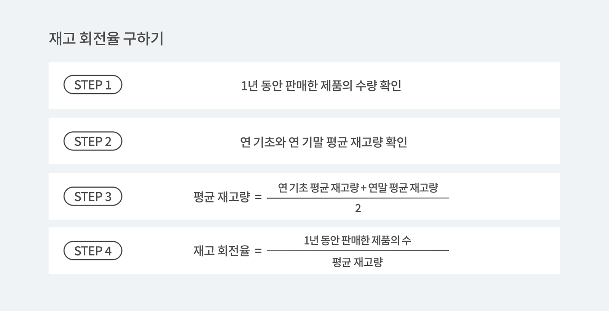

사업장이 잘 운영되기 위해서는 특히 재고 관리가 미래 성공의 가장 강력한 지표입니다. 

재고 회전율에 대한 확실한 이해는 비즈니스 기대치를 현실로 바꿀 수 있습니다. 재고 회전율은 회사가 공급업체에서 공급망으로 들어오는 재고를 얼마나 효율적으로 처리하는지 판단하는 지표로 활용됩니다.

비즈니스가 완벽하게 잘 운영되고 있는지 판단하는 여러가지 방법 중 한가지인 재고 회전율에 대해 알아볼까요?

## 1. **재고 회전율이란 무엇일까요?**

재고 회전율은 주어진 기간 동안 재고에서 얼마나 많은 품목이 판매되었는지를 나타내는 척도입니다. 정의에 따르면 재고 회전율은 비즈니스가 상품을 얼마나 잘 판매하고 있는지 확인하는 중요한 척도임이 분명합니다. 여기서 재고 회전율이란 일정 기간의 상품, 제품, 원재료 등의 출고량과 재고량의 비율을 말하며, 특히 재고량은 월평균 재고량에 의 해 나타냅니다. 간단하게 예를 들면, 1년에 몇 회 재고가 회전했는지를 나타내는 것으로서 500% 라고 한다면 1년간 재고가 5회전 한 것을 의미한다고 할 수 있습니다. 

좀 더 쉽게 말하면 재고회전율은 일정 기간 재고가 모두 팔리고 채워지는 속도라고 할 수 있습니다. 음식점 내 테이블이 채워지고 비워지는 것을 '회전율'이라고 하죠? 여기서 식당을 관리하는 창고로 바꾸어 생각하면 이해하기 쉬울거에요.

## 2. **그럼 재고회전율은 어떤 방식으로 구할 수 있을까요?**

재고회전율은 <mark>출고량(매출액)÷평균재고량(평균재고 자산액수)x100(%)</mark> 이지만 보통 %로 표시하지 않고 '몇 회전'으로 표시하는 것이 일반적입니다. 

재고회전율을 계산하는 방법에 대해 좀 더 자세히 알아볼까요? 

<invisible>
재고 회전율 구하기 / 1년 동안 판매한 제품의 수량 확인, 연 기초와 연 기말 평균 재고량 확인, 평균 재고량 = (연 기초 평균 재고량 + 연말 평균 재고량)/2, 재고 회전율 = 1년 동안 판매한 제품의 수 / 평균 재고량
</invisible>

---

1. 기간 내 판매한 재고의 수량을 구하세요. 
- <gray-text>기간은 1년 또는 한 달 등 다양한 기간에 적용이 가능합니다.</gray-text> 
2. 기간 내 기초, 기말 수량을 구하세요. 
- <gray-text> 1년으로 적용했을 때 연초, 연말 재고량으로/ 한 달로 적용했을 때 월초, 월말 재고량을 구하는 것을 추천합니다. 다만 1번의 재고 수량에 적용한 기간과 같은 기간 내의 기초, 기말 수량이어야 한다는 사실, 잊지 마세요!</gray-text> 
3. 기초와 기말 수량을 더한 뒤 2로 나누면 평균 재고량에 대해 알 수 있습니다.
4. 마지막으로 한 번의 기간 내 판매한 재고 수량을 평균 재고량으로 나눈 수가 바로 재고 회전율입니다.

---

## 3. 재고 회전율을 사용하여 알 수 있는 사실

### **재고 회전율이 높다는 것은?**

재고 회전율이 높다는 것은 창고의 재고이동이 많다는 뜻입니다. 그렇게 되면 자본 수익률이 높아지고, 상품의 재고 손실을 예방하고 막는 것은 물론이고 보험료나 창고 보관료를 세이브 할 수 있어서 사업장에 매우 유리합니다. 이상적인 재고 회전율은 4-6정도로 볼 수 있으나, 이는 모든 사업장에 해당 되는 것이 아니므로 참고사항일 뿐 먼저 사업장의 특성을 파악하는 것이 매우 중요합니다. 특성상 회전율이 높거나 낮은 사업장일 수 있기 때문에 오히려 내 사업장의 회전율과 비슷한 사업장들과 비교하는 것이 도움이 될 거에요! 

하지만, 재고회전율이 과도하게 높을 시에는 원재료/제품의 부족 현상이 일어날 수 있어 제품 생산이나 판매활동에 지장을 초래할 수 있습니다. 또한 창고에 너무 많은 재고가 너무 오래 보관되어 있다면 재고가 너무 많아 소비자가 요구하는 것보다 더 많은 재고를 보유하고 있을 수 있습니다. 반면에 계속해서 재주문을 하고 있다면 재고가 없다는 신호일 수 있습니다. 즉, 제품이 너무 빨리 매진되거나 재고가 너무 낮아 소비자 수요를 충족할 수 없다는 의미일 수 있어요. 재고 회전율은 재고 관리가 효율적인 방법으로 얼마나 효과적인지 알아내는 역할을 합니다!

### **재고 회전율이 필요한 이유**

여기서 재고 회전율이 필요한 이유를 정리하자면, 만일 창고 내 재고가 너무 많이 쌓이다보면 과재고를 의심해 볼 필요가 있고, 너무 빠르게 소진된다면 재고 부족을 미리 고려해봐야 합니다. 물론 재고가 빠르게 소진된다는건 매출 상승의 의미이므로 좋은 일이지만, 어쩌면 발주를 넣는 재주문점을 제대로 파악하지 못한 부분일 수도 있습니다. "현재 내 재고량은 적정한 건가?" 라는 의문이 든다면 재고 회전율을 계산해볼 필요가 있습니다.
<tip-box>

다시보는 **재고 회전율 계산 방법** 
재고회전율 = 총매출액 / 평균재고,  <mark>출고량(매출액)÷평균재고량(평균재고 자산액수)x100(%)</mark>

</tip-box>

---

## 박스히어로와 함께라면 재고 회전율을 효과적으로 관리할 수 있습니다.

박스히어로에는 재고 회전율을 계산 및 분석할 수 있는 다양한 기능이 있습니다.

- 재고 분석 메뉴를 사용하여 재고 회전율을 빠르게 계산하여 한 눈에 확인이 가능합니다.
- 재고 회전율의 현황을 쉽게 파악하여 각 상황에 빠르게 대처할 수 있습니다.
- 재고 회전율을 정확하게 파악하여 재고 수준을 최적으로 유지할 수 있습니다.

<tip-box>

**박스히어로는 PC와 모바일, 모든 환경에서 사용할 수 있습니다.** 
PC가 없는 환경에서도 재고관리는 멈추지 않고 계속됩니다. 
강력한 모바일 앱을 지원해 스마트폰에서도 박스히어로를 사용할 수 있습니다.

</tip-box>

