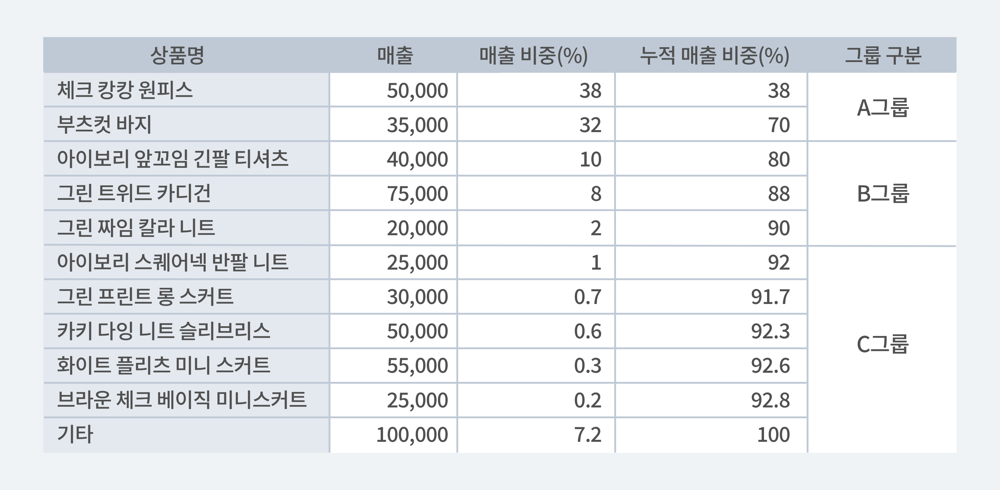

## ABC분석과 VED분석으로 효율적으로 재고에 대한 데이터 분석하기

효율적인 재고관리를 위해서는 철저한 데이터 분석이 기본적으로 필요합니다.

보다 정확한 재고관리를 위한 두 가지의 재고 데이터 분석 방법을 알려드리려고 합니다.

### 1. ABC 분석

ABC분석은 취급하는 모든 제품을 똑같은 수준의 같은 방식으로 다루어서는 안된다는 개념에서 시작되었습니다. 또한 20%의 제품이 80%의 매출을 차지한다는 말 또한 ABC분석에서 근거한 말입니다. 

ABC분석이란, 일반적으로 제품의 매출을 중요도에 따라서 분류하는 방법이며 취급하는 모든 제품들을 한데 모아 그 중에 매출 비중의 70%를 차지하는 제품의 그룹을 A, 20%는 B, 10%는 C. 이렇게 세 부류로 나누어 분류하여 분석하는 기법입니다. 매출 기여도가 높다고 평가된 A그룹은 그만큼 재고 회전율이 높으므로 재고관리나 마케팅 측면에서 신경을 많이 쎠야 하는 반면에, 매출 기여도가 상대적으로 낮은 C그룹은 신경을 덜 쓰고 효율적으로 관리할 수 있을 것입니다. 분석 기준은 기본적으로 매출 뿐만 아니라 판매 수량 등 다양한 방법을 기준을 설정할 수 있습니다. 

---

### 예시로 알아보는 데이터를 활용한 ABC분석

아래 예시는 어느 옷가게의 판매 상품을 매출 순서대로 정리하여 사업장의 총 매출에서 차지하는 비중과 누적 비율을 계산한 것입니다.

상품별 매출 비중이 큰 순서대로 더해서 누적 매출의 비중이 70%를 달성한 체크 캉캉 원피스와 부츠컷 바지를 A그룹으로 묶었고, 누적 매출 비중이 80-90%에 달하는 아이보리 앞꼬임 긴팔 티셔츠와 그린 트위드 카디건, 그린 짜임 칼라 니트를 B그룹, 기타 나머지 상품은 C그룹으로 나누어보았습니다. 

이처럼 ABC 분석의 제일 기본은 여러 상품들을 매장의 매출 기여도에 따라 A/B/C/ 그룹으로 나누는 것입니다. 단순히 그룹으로 나누기만 하면 되는 것이 아니라 이제 분석을 시작해야겠죠?

이제 매출 기여도에 따라 그룹 별로 분석을 시작해보겠습니다.

1. 매출 기여도가 제일 높은 A그룹 
물류 창고에서도 가장 많은 공간을 차지할 것입니다. 전의 판매 데이터를 참고해서 더욱 계획적인 판매 예측을 해야 하는 그룹입니다. 의류 매장이므로 계절별로 나누는 것을 추천드립니다! 또한 매출기여도가 가장 높은 그룹이므로 재고가 떨어지는 일이 되도록이면 없도록 철저하고 꼼꼼한 관리가 필요합니다.
2. 매출 기여도가 중간인B그룹 
A그룹과 C그룹의 중간의 비중을 차지하고 있습니다. 적절한 판매량을 예측하여 재고가 없을 때 새로 만들거나 상품을 들여오는 방식으로 관리가 가능합니다.
3. 매출 기여도가 제일 적은 C그룹
물류 창고에 의류 당 최소한으로 준비해 두는 것이 효과적입니다. 판매량을 따로 예측하지 않고 품절 현상이 발생하더라도 괜찮습니다. 하지만 생각보다 너무 판매가 이루어지지 않는다면, 들여오지 않는 방안도 생각해보아야 합니다.

---

이렇게 각 그룹에 맞는 재고 관리 방안을 찾는 것이 ABC분석의 목적이라고 할 수 있습니다.

**그럼 ABC분석은 언제 사용할 수 있을까요?** 

1. 매출에 기여하는 제품을 파악하여 중점적으로 관리하고 싶을 때
2. 마케팅 비용을 투자해야하는 제품의 종류를 파악하고 싶을 때
3. A그룹에만 마케팅을 집중하여 매출을 올리고 싶을 때

재고 데이터를 효과적으로 분석하는 방법에는 ABC분석만 있는 건 아니에요! 

ABC분석과 함께 자주 거론되는 VED분석에 대해서도 알아볼까요?

### 2. VED 분석

VED 분석은 자재 관리자가 원하는 서비스 수준과 최종적으로 해당 서비스 수준을 달성하는데 필요한 안전 재고량을 결정할 수 있도록 도와줄 뿐만 아니라 필요할 때 창고의 재고 가용성을 나타낼 수 있는 지표로 사용되는 분석 중 하나입니다! 따라서 VED 분석은 기능적으로 중요도에 따라 재고를 분류하는 재고 관리 기법이며, 생산 또는 기타 활동을 위한 조직의 중요성과 필요성에 따라 크게 세 가지로 나눌 수 있습니다. 

---

- **V - 바이탈 카테고리** : 필요시 재고가 반드시 있어야 하는 품목 'Must'

 바이탈 카테고리에서는 재고 부족 현상에 대해 높은 기회비용 현상이 발생하거나 사업장의 중단 등 과 같은 치명적인 영향을 갖고 있는 제품의 경우로, 이러한 제품의 재고 부족 현상은 극도로 피해야 합니다. 예를 들어 VED 분석을 많이 이용하는 사업장인 병원과 약국의 의약품 재고관리의 경우 한 사람의 생명을 좌지우지 하는 의약품에 대해서는 바이탈 카테고리로 분류해야 할 것입니다.

- **E - 필수 카테코리 :** 필수품으로 재고가 있어야 하는 품목 'Should'

 필수 카테고리에서는 상당한 재고 부족 현상이 일어날 확률이 다분하지만 바이탈 카테고리와 같이 확률이 높거나 매우 위험한 것은 아닙니다. 의약품을 예로 들면 필수 카테고리에 포함되어야 할 제품들은 어느 정도 밀리는 것을 고려해도 되지만 이로 인해 한 생명이 목숨을 잃거나 대체품을 구할 수 없을 수도 있으니 주의를 귀울여야 합니다.

- **D - 원하는 카테고리** : 재고가 있을 수도 있는 품목 'Can'

원하는 카테고리의 경우 재고 부족 현상 발생 시 비용이 낮은 제품을 의미하거나 여전히 재고 부족 현상의 위험이 존재하는 제품들의 카테고리를 말합니다. 비타민, 식품 보조 등의 의약품이 이 카테고리에 해당된다고 볼 수 있습니다.

---

## 그럼 VED 분석은 왜 중요한 걸까요?

재고관리에서 중요한 것은 무엇보다 모든 부분에서 최적의 재고 수준을 유지하는 것입니다. 재고 유지에는 비용이 뒤따르는데 이 분석은 재고 유지 관리에 대한 관리 결정을 도와주기 위해 재고를 세 가지 종류로 분류하는 것입니다! 

---

**재고 유지 비용의 네 가지 유형**

1. **품목 비용** : 재고 항목의 비용 또는 가격입니다. 현재 보유하고 있는 재고의 실제 구매 가치입니다. 따라서 재고 많을 수록 높을 것이며 그 반대의 경우도 마찬가지입니다.
2. **주문/설치 비용** :  재고 구매에는 특정 비용이 포함되는데, 이로는 운송비, 포장비 등이 포함됩니다.
3. **유지 비용** : 재고의 보관, 보험료, 재고 취급과 관련된 인건비 등이 포함되며 또한 가지고 있는 재고의 손상, 누출 또는 도난도 포함됩니다. 
4. **재고 소진 비용** : 재고 소진 비용은 재고 품목의 재고가 소진된 결과입니다. 제품의 품절로 인한 생산 손실이 포함되며 이로 인해 상품 판매가 지연될 수 있습니다. 또한 상품 자체가 품절되는 경우도 있으며 이러한 손실은 품절 비용의 일부로 포함됩니다.

---

### **VED 분석의 활용 사례 더 알아보기**

VED 분석이 가장 많이 적용되는 사업장은 약국과 병원에서의 의료 재고를 유지하는 것입니다. 

의약품 및 관련 용품은 병원 예산에 상당 부분을 차지하고 있으며 또한 많은 의약품들을 최적의 상태로 보관하는 것은 관리에 있어서 가장 중요하지만 어려운 작업입니다. 필수 의약품이 소진되는 경우에는 자칫하면 인명 손실로 이어질 수 있지만 그와 반대로 중요하지 않은 의약품의 재고가 과도하게 많으면 그만큼 재고 낭비로 이어질 수 있습니다. 

이로 인해 VED분석과 같은 과학적인 방법은 필수 부품 또는 제품의 부족 또는 비가용성 위험을 초래하지 않고 최적의 재고 수준을 유지하는데 많은 도움이 됩니다. 

---

## 재고관리에 어려움을 겪고 계신가요? 지금 바로 박스히어로를 시작해보세요.
박스히어로는 누구나 쉽게 사용할 수 있는 재고관리 특화 솔루션입니다. 
다양한 재고관리 기능을 통해 업종 구분없이 모든 비즈니스에서 도입이 가능합니다. 
**이제 박스히어로와 함께 쉽고 정확하게 재고관리하세요.**

<tip-box>

**박스히어로는 PC와 모바일, 모든 환경에서 사용할 수 있습니다.** 
PC가 없는 환경에서도 재고관리는 멈추지 않고 계속됩니다. 
강력한 모바일 앱을 지원해 스마트폰에서도 박스히어로를 사용할 수 있습니다.

</tip-box>

